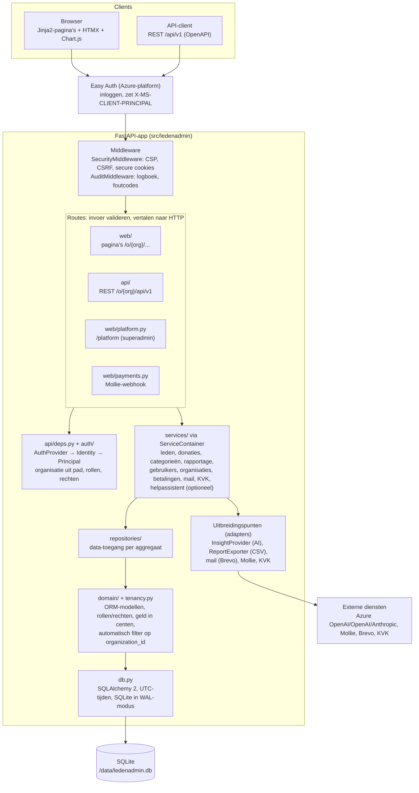
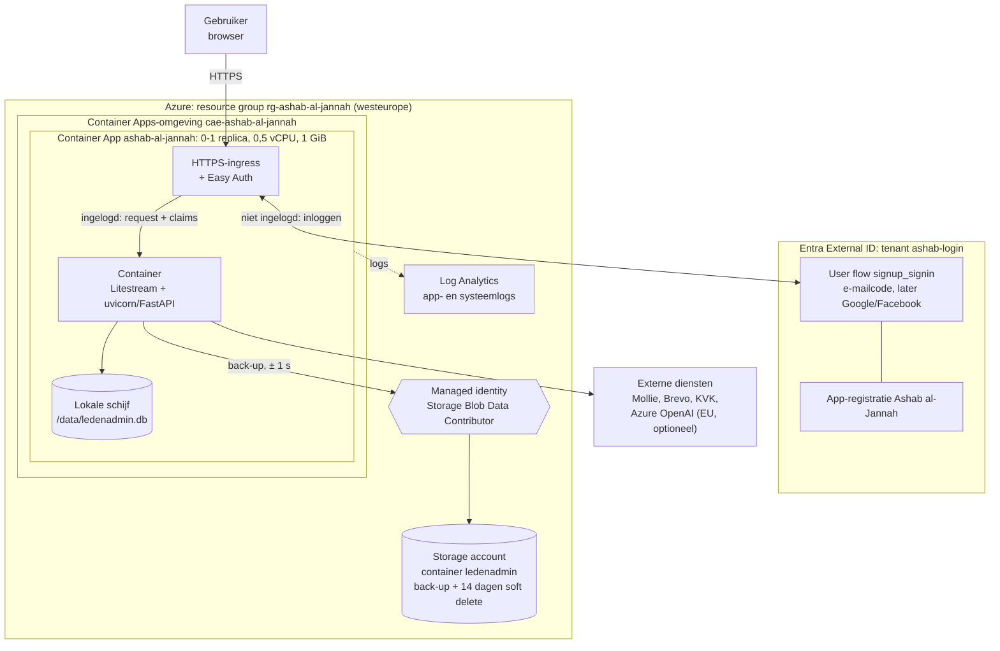
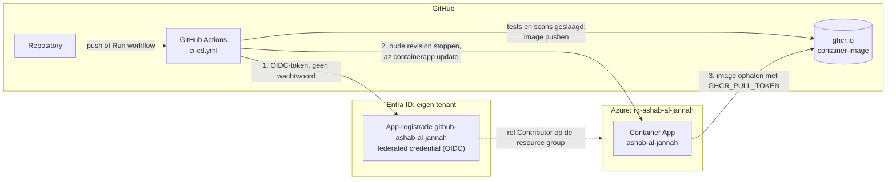
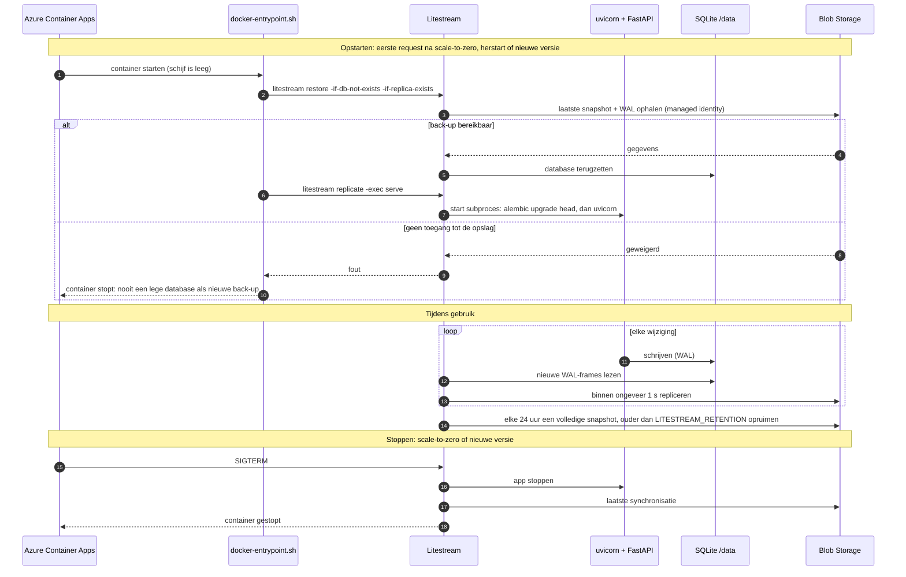
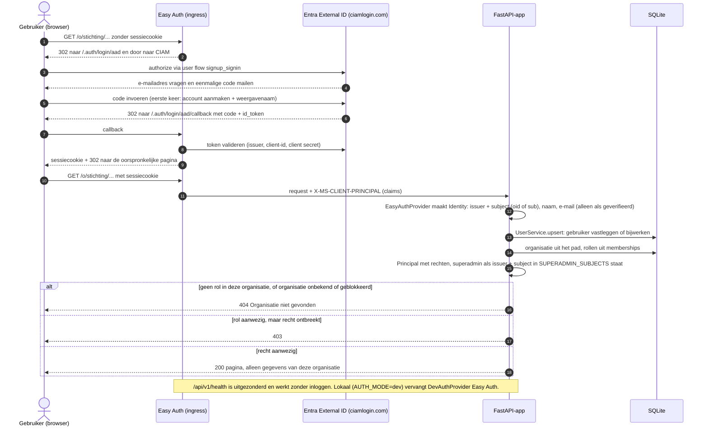

# Ashab al-Jannah <span lang="ar" dir="rtl">أَصْحَابُ الْجَنَّةِ</span>

**Ledenadministratie met AI.** Ashab al-Jannah is een eenvoudige, responsieve webapp voor
ledenadministratie en donatieregistratie van een vereniging. Beheerders, penningmeesters en bestuurders gebruiken de applicatie vanaf
mobiel, tablet of laptop. Registratie, rapportage en trendinzichten zitten in de MVP.
Boekhoudkoppelingen en het inlezen van bankafschriften volgen later via de bestaande
uitbreidingspunten.

> [!TIP]
> **🌐 Probeer de demo:**
> **[ashab-al-jannah.blackmushroom-9f4102d8.westeurope.azurecontainerapps.io](https://ashab-al-jannah.blackmushroom-9f4102d8.westeurope.azurecontainerapps.io/)**
>
> 1. Kies op de inlogpagina **Geen account? Maak er een** en log in met een eenmalige code
>    die je per e-mail krijgt.
> 2. Klik op **Nieuwe stichting aanmaken**. Je bent meteen beheerder van je eigen
>    demo-organisatie.
> 3. Voeg leden, categorieën en donaties toe en bekijk de rapportage.
>
> Het is een demo: gebruik geen echte persoonsgegevens. De eerste keer laden kan 30–60
> seconden duren, omdat de app opstart als hij een tijd niet gebruikt is.

| Document | Inhoud |
|---|---|
| [1-UserStories](./1-UserStories.md) | User stories en acceptatiecriteria (US01–US10) |
| [2-TestScenarios](./2-TestScenarios) | Gherkin-scenario's, 1-op-1 geautomatiseerd in [tests/functional](./tests/functional) |
| [3-MultiTenantOntwerp](./3-MultiTenantOntwerp.md) | Ontwerp voor meerdere stichtingen, hosting en kosten |
| [4-EntraExternalID](./4-EntraExternalID.md) | Inloggen met Entra External ID (Google, Microsoft, e-mailcode) en Easy Auth |
| [.env.example](./.env.example) | Alle configuratie-instellingen |
| [ci-cd.yml](./.github/workflows/ci-cd.yml) | CI/CD-workflow: tests, scans, image en deploy naar Azure |
| [LICENSE](./LICENSE.md) | PolyForm Noncommercial License 1.0.0 |

## Inhoud

- [Over de naam](#over-de-naam)
- [Snel starten (lokaal)](#snel-starten-lokaal)
  - [Optie A – Met Python en `start.ps1`](#optie-a--met-python-en-startps1)
    - [Lokaal en multi-tenant](#lokaal-en-multi-tenant)
    - [Platformbeheer en meerdere organisaties lokaal testen](#platformbeheer-en-meerdere-organisaties-lokaal-testen)
    - [Demo met Playwright](#demo-met-playwright)
  - [Optie B – Container-image met Docker (Windows en Linux)](#optie-b--container-image-met-docker-windows-en-linux)
    - [Docker installeren](#docker-installeren)
    - [B1 – Kant-en-klare image van GitHub (zonder clonen)](#b1--kant-en-klare-image-van-github-zonder-clonen)
    - [B2 – Zelf bouwen vanuit de broncode](#b2--zelf-bouwen-vanuit-de-broncode)
    - [Waar staan de gegevens?](#waar-staan-de-gegevens)
- [Techstack](#techstack)
- [Architectuur](#architectuur)
  - [Softwarelagen](#softwarelagen)
  - [Deploymentmodel (infrastructuur)](#deploymentmodel-infrastructuur)
  - [Back-up en herstel (sequence)](#back-up-en-herstel-sequence)
  - [Inloggen en autorisatie (sequence)](#inloggen-en-autorisatie-sequence)
- [Gebruikers en autorisatie](#gebruikers-en-autorisatie)
  - [Superadmin (platformbeheer)](#superadmin-platformbeheer)
  - [Ledenvelden](#ledenvelden)
  - [Logboek](#logboek)
- [Functionele requirements](#functionele-requirements)
  - [Leden (US01)](#leden-us01)
  - [Donaties (US02)](#donaties-us02)
  - [Categorieën beheren](#categorieën-beheren)
  - [Rapportage (US04–US06)](#rapportage-us04us06)
  - [AI-inzichten (US07)](#ai-inzichten-us07)
  - [Helpassistent (US16)](#helpassistent-us16)
- [Niet-functionele requirements](#niet-functionele-requirements)
- [Configuratie](#configuratie)
  - [Checklist productie (alle fases)](#checklist-productie-alle-fases)
- [Tests en kwaliteit](#tests-en-kwaliteit)
- [Deployment naar Azure](#deployment-naar-azure)
  - [Eerste deployment stap voor stap](#eerste-deployment-stap-voor-stap)
    - [Stap 0 – Variabelen vastleggen](#stap-0--variabelen-vastleggen-cloud-shell)
    - [Stap 1 – Resource group](#stap-1--resource-group-cloud-shell)
    - [Stap 2 – Resource providers registreren](#stap-2--resource-providers-registreren-cloud-shell)
    - [Stap 3 – Opslag voor de back-up](#stap-3--opslag-voor-de-back-up-cloud-shell)
    - [Stap 4 – GitHub laat inloggen bij Azure met OIDC](#stap-4--github-laat-inloggen-bij-azure-met-oidc-cloud-shell)
    - [Stap 5 – Secrets en variabele in GitHub](#stap-5--secrets-en-variabele-in-github-powershell-op-je-pc--browser)
    - [Stap 6 – Eerste deploy](#stap-6--eerste-deploy-powershell-op-je-pc)
    - [Stap 7 – App toegang geven tot de opslag](#stap-7--app-toegang-geven-tot-de-opslag-cloud-shell)
    - [Stap 8 – Inloggen met Entra External ID (Easy Auth)](#stap-8--inloggen-met-entra-external-id-easy-auth)
      (achtergrond: [4-EntraExternalID](./4-EntraExternalID.md))
    - [Stap 9 – Jezelf superadmin maken](#stap-9--jezelf-superadmin-maken-cloud-shell)
  - [Instellingen later wijzigen](#instellingen-later-wijzigen)
  - [Helpassistent aanzetten (Azure OpenAI)](#helpassistent-aanzetten-azure-openai)
    - [A1 – Resource provider registreren](#a1--resource-provider-registreren-cloud-shell)
    - [A2 – Azure OpenAI-resource in de EU](#a2--azure-openai-resource-in-de-eu-cloud-shell)
    - [A3 – Model deployen met harde grenzen](#a3--model-deployen-met-harde-grenzen-cloud-shell)
    - [A4 – Proefvraag aan het model](#a4--proefvraag-aan-het-model-cloud-shell)
    - [A5 – Instellingen in GitHub](#a5--instellingen-in-github-powershell-op-je-pc)
    - [A6 – Deployen](#a6--deployen-powershell)
    - [A7 – Testen](#a7--testen-browser)
    - [Kosten en extra grenzen](#kosten-en-extra-grenzen)
    - [Uitzetten](#uitzetten)
  - [Helpassistent met Google Gemini](#helpassistent-met-google-gemini)
    - [G1 – API-sleutel in Google AI Studio](#g1--api-sleutel-in-google-ai-studio-browser)
    - [G2 – Model kiezen en proefvraag](#g2--model-kiezen-en-proefvraag-cloud-shell)
    - [G3 – Instellingen in GitHub](#g3--instellingen-in-github-powershell-op-je-pc)
    - [G4 – Deployen en testen](#g4--deployen-en-testen)
  - [Wisselen tussen Azure OpenAI en Gemini](#wisselen-tussen-azure-openai-en-gemini)
  - [Troubleshooting deployment](#troubleshooting-deployment)
  - [Back-up en herstel](#back-up-en-herstel)
  - [Overstap van Azure SQL](#overstap-van-azure-sql)
- [Uitbreidingen na de MVP](#uitbreidingen-na-de-mvp)
- [Open besluiten](#open-besluiten)
- [Licentie](#licentie)
- [Online doneren (Mollie)](#online-doneren-mollie)

## Over de naam

*Ashab al-Jannah* (أَصْحَابُ الْجَنَّةِ) betekent letterlijk "de metgezellen van de tuin" en
wordt in de Koran vooral gebruikt voor de bewoners van het Paradijs (bijv. 59:20). De
naam staat centraal in de code (`APP_NAME` in
[`__init__.py`](./src/ledenadmin/__init__.py)), zodat UI, API-titel en paginatitels
consistent blijven. De Python-package heet intern `ledenadmin`.

## Snel starten (lokaal)

Er zijn twee manieren: direct met Python via `start.ps1` (handig om te ontwikkelen) of
met de container-image via Docker (zonder Python op je machine).

### Optie A – Met Python en `start.ps1`

1. **Installeer de benodigdheden**
   - [Git](https://git-scm.com/downloads), bijv. `winget install Git.Git`.
   - [Python 3.12 of hoger](https://www.python.org/downloads/), bijv.
     `winget install Python.Python.3.12`. Vink bij de installer *Add python.exe to PATH* aan.
   - Op Linux/macOS: `git` en `python3` (met `venv`) via de pakketbeheerder. `start.ps1` is
     Windows-only; gebruik daar de commando's onder stap 3.
2. **Clone de repository**

   ```powershell
   git clone https://github.com/muratbalasar/ashab-al-jannah.git
   cd ashab-al-jannah
   ```

3. **Start de app** (de eerste keer duurt het installeren even):

   ```powershell
   .\start.ps1 -Install -InitWithDummyData   # venv + dependencies, migraties, demodata, server
   ```

   Weigert Windows het script, sta dan lokale scripts toe voor deze sessie:
   `Set-ExecutionPolicy -Scope Process RemoteSigned`.

   Linux/macOS (zelfde stappen als `start.ps1`):

   ```sh
   python3 -m venv .venv && . .venv/bin/activate
   pip install -r requirements-dev.txt && pip install -e . --no-deps
   export AUTH_MODE=dev DATABASE_URL=sqlite:///./ledenadmin.db
   alembic upgrade head
   python -m ledenadmin.dummy_data            # optioneel: demodata
   uvicorn --factory ledenadmin.main:create_app --reload --port 8000
   ```
4. **Open** <http://127.0.0.1:8000> (API-documentatie: <http://127.0.0.1:8000/api/docs>).
   Stoppen doe je met `Ctrl+C`. Daarna is `.\start.ps1` genoeg om opnieuw te starten.

`start.ps1` zet `AUTH_MODE=dev`: iedereen is dan automatisch aangemeld met alle rollen.
Met `.\start.ps1 -InitWithDummyData` worden 120 dummy leden (e-mail `*.dummy@voorbeeld.nl`)
met donaties verspreid over de afgelopen 18 maanden en alle subcategorieën toegevoegd. Bestaande
dummy leden worden overgeslagen, dus de optie kan veilig vaker worden gebruikt.
De lokale database (`ledenadmin.db`) blijft bewaard bij stoppen en herstarten. Met
`.\start.ps1 -ResetDatabase` begin je met een lege database (alleen voor SQLite). Combineer
met `-InitWithDummyData` voor een schone demo-omgeving.
Gebruik dit alleen lokaal; met `APP_ENV=production` weigert de applicatie te starten.

#### Lokaal en multi-tenant

Lokaal hoeft u niets aan organisaties in te richten. Bij het starten wordt automatisch de
organisatie **`standaard`** aangemaakt; `http://localhost:8000/` en oude URL's zoals `/leden`
sturen door naar `/o/standaard/...`. De dev-gebruiker krijgt daar de rollen uit
`DEV_USER_ROLES` (standaard alle). Zonder `SECRET_ENCRYPTION_KEY`, `BREVO_API_KEY` en
`KVK_API_KEY` staan online doneren, mailen en de KVK-check uit; de rest werkt gewoon.

Meerdere organisaties of rollen lokaal testen:

- Nieuwe organisatie: ga naar `/aanmelden` (KVK-nummer alleen op formaat gecontroleerd).
- Andere gebruiker: klik op de **DEV**-badge rechtsboven (of ga naar `/dev/gebruiker`) en vul
  een naam of e-mailadres in. Zo accepteert u lokaal een uitnodiging: meld u aan met het
  e-mailadres waarvoor de uitnodiging is gemaakt (de uitnodigingspagina linkt er ook naar).
  Een gewisselde gebruiker krijgt geen rollen uit `DEV_USER_ROLES`, alleen die uit
  uitnodigingen; met **Terug naar …** wordt u weer de standaardgebruiker. De keuze geldt per
  browser (cookie); gebruik een privévenster om twee gebruikers naast elkaar te testen.
- Rollen via headers: stuur `X-Dev-User` en `X-Dev-Roles` mee (bijv. met een browserextensie),
  of zet `DEV_USER_NAME`/`DEV_USER_ROLES` en herstart. Uitnodigingslinks verschijnen op het
  scherm om te kopiëren.
- Superadmin (`/platform`): `SUPERADMIN_SUBJECTS=dev|ontwikkelaar` (zie hieronder).
- Mollie testen: zet `SECRET_ENCRYPTION_KEY` en koppel een `test_`-sleutel; zonder publieke
  URL wordt de status bijgewerkt als u terugkeert van de betaalpagina.

#### Platformbeheer en meerdere organisaties lokaal testen

1. **Start als superadmin** (stop eerst een draaiende server met `Ctrl+C`):

   ```powershell
   $env:SUPERADMIN_SUBJECTS = "dev|ontwikkelaar"   # meer: "dev|ontwikkelaar,dev|beheerder-a"
   .\start.ps1                                      # of: .\start.ps1 -ResetDatabase
   ```

   In het menu staat dan **Platform** (`/platform`).
2. **Maak organisaties aan met verschillende gebruikers.** Eén gebruiker mag één organisatie
   per 24 uur aanmaken (maximaal `MAX_ORGANIZATIONS_PER_USER`, standaard 3). Wissel daarom
   per organisatie van gebruiker via de **DEV**-badge (`/dev/gebruiker`), bijv. `beheerder-a`,
   `beheerder-b`, en meld een organisatie aan op `/aanmelden` met een eigen KVK-nummer van
   8 cijfers (`11111111`, `22222222`, …). Voeg eventueel leden en donaties toe. Met
   **Terug naar ontwikkelaar** bent u weer superadmin.
3. **Test op `/platform`:**

   | Functie | Hoe |
   |---|---|
   | Overzicht | KVK, plaats, gebruikers, leden, laatste activiteit, status; totalen en fouten (24 uur) |
   | Blokkeren / deblokkeren | Blokkeer, wissel naar de beheerder: `/o/<slug>/` geeft 404 |
   | Verwijderen en herstellen | Als beheerder: **Instellingen** → **Organisatie verwijderen** (typ de slug). Op `/platform` staat ze als verwijderd met de wisdatum; **Herstellen** of **Nu wissen** |
   | Privacy | Als superadmin zonder rol geeft `/o/<slug>/leden` een 404 |
   | Scheiding | Nodig `beheerder-a` uit in organisatie B: op `/` ziet hij beide, de gegevens blijven gescheiden |

   Gebruik een privévenster voor een tweede gebruiker naast het superadmin-venster. Dezelfde
   uitleg staat lokaal in de app onder **Help** → *Lokaal testen (ontwikkelmodus)*.

#### Demo met Playwright

`.\demo.ps1` geeft een geautomatiseerde rondleiding in de browser (Edge), met een ondertitel
per stap: een nieuwe stichting aanmelden, drie leden met donaties registreren, een donatie via
het zoekveld invoeren, de rapportage bekijken, een penningmeester uitnodigen die in een tweede
venster de uitnodiging accepteert en zelf een donatie invoert. De demo draait op poort 8770
met een eigen, verse database (`output\demo\demo.db`); `ledenadmin.db` en `.env` blijven
ongemoeid. Playwright wordt zo nodig geïnstalleerd (`requirements-demo.txt`).

```powershell
.\demo.ps1                    # 1,5 seconde tussen de acties
.\demo.ps1 -Pauze 3 -Platform # langzamer, en aan het eind /platform als superadmin
.\demo.ps1 -Browser chromium  # zonder Edge: installeert de Chromium van Playwright
```

### Optie B – Container-image met Docker (Windows en Linux)

#### Docker installeren

**Windows 10/11**

1. Zet WSL 2 aan (PowerShell als administrator), en herstart daarna de pc:

   ```powershell
   wsl --install
   ```

2. Installeer Docker Desktop:

   ```powershell
   winget install -e --id Docker.DockerDesktop
   ```

   Of download het via [docker.com](https://www.docker.com/products/docker-desktop/).
3. Start **Docker Desktop** en wacht tot onderin "Engine running" staat.
4. Controleer: `docker run --rm hello-world`.

**Linux (Ubuntu/Debian)**

```sh
curl -fsSL https://get.docker.com | sudo sh   # officieel installatiescript
sudo usermod -aG docker $USER                 # docker zonder sudo gebruiken
newgrp docker                                  # of opnieuw inloggen
docker run --rm hello-world                    # controle
```

Andere distributies: zie [Docker Engine installeren](https://docs.docker.com/engine/install/).

#### B1 – Kant-en-klare image van GitHub (zonder clonen)

Elke push op `main` waarvan de tests slagen, publiceert de image als
[package op GitHub](https://github.com/muratbalasar/ashab-al-jannah/pkgs/container/ashab-al-jannah)
(`ghcr.io/muratbalasar/ashab-al-jannah:latest`). Docker haalt hem bij de eerste start
automatisch op; bijwerken naar de nieuwste versie doe je met
`docker pull ghcr.io/muratbalasar/ashab-al-jannah:latest`.

Linux (bash):

```sh
docker run --rm -p 8000:8000 \
  -e APP_ENV=development -e AUTH_MODE=dev \
  -v ashab-data:/data \
  --name ashab ghcr.io/muratbalasar/ashab-al-jannah:latest
```

Windows (PowerShell):

```powershell
docker run --rm -p 8000:8000 `
  -e APP_ENV=development -e AUTH_MODE=dev `
  -v ashab-data:/data `
  --name ashab ghcr.io/muratbalasar/ashab-al-jannah:latest
```

Open daarna <http://127.0.0.1:8000>. De instellingen worden hieronder bij B2, stap 3, uitgelegd.

#### B2 – Zelf bouwen vanuit de broncode

1. Clone de repository zoals bij optie A, stap 2.
2. **Bouw de image** (in de map `ashab-al-jannah`):

   ```sh
   docker build -t ashab-al-jannah .
   ```

3. **Start de container**. De image staat standaard op productie (echte aanmelding, en
   SQLite alleen met een back-up via Litestream). Voor lokaal gebruik zet je ontwikkelmodus
   aan en bewaar je de SQLite-database (`/data/ledenadmin.db`) in een Docker-volume, zodat
   de gegevens een herstart overleven.

   Linux (bash):

   ```sh
   docker run --rm -p 8000:8000 \
     -e APP_ENV=development -e AUTH_MODE=dev \
     -v ashab-data:/data \
     --name ashab ashab-al-jannah
   ```

   Windows (PowerShell):

   ```powershell
   docker run --rm -p 8000:8000 `
     -e APP_ENV=development -e AUTH_MODE=dev `
     -v ashab-data:/data `
     --name ashab ashab-al-jannah
   ```

4. **Open** <http://127.0.0.1:8000>. Wil je demodata, voer dan in een tweede terminal uit:
   `docker exec ashab python -m ledenadmin.dummy_data`.
   Stoppen doe je met `Ctrl+C` of `docker stop ashab`. Een lege database krijg je met
   `docker volume rm ashab-data`.

#### Waar staan de gegevens?

De SQLite-database (`/data/ledenadmin.db`) staat niet in de container zelf, maar in het
Docker-volume `ashab-data` (`-v ashab-data:/data`). Docker beheert dat volume buiten de
container.

- **Stoppen en opnieuw starten:** `--rm` verwijdert de container bij het stoppen, maar het
  volume blijft bestaan. Start je opnieuw met hetzelfde commando, dan zijn alle leden en
  donaties er nog.
- **Nieuwe image (`docker pull`):** de gegevens blijven behouden. Bij het opstarten werkt
  de app het databaseschema automatisch bij (`RUN_MIGRATIONS=true`).
- **Gegevens kwijt:** als je `-v ashab-data:/data` weglaat (de database staat dan in de
  container en verdwijnt bij het stoppen), of na `docker volume rm ashab-data`.
- **Eerdere versie met `-v ashab-data:/home/app`?** Dat blijft werken als je ook
  `-e DATABASE_URL=sqlite:////home/app/ledenadmin.db` meegeeft, zoals voorheen.
- **Back-up maken** (Linux; gebruik in PowerShell `${PWD}`):

  ```sh
  docker run --rm -v ashab-data:/data -v "$PWD":/backup alpine cp /data/ledenadmin.db /backup/
  ```

Gebruik `AUTH_MODE=dev` nooit op een publiek bereikbare server: iedereen heeft dan alle
rechten. Zie [Configuratie](#configuratie) en [Deployment naar Azure](#deployment-naar-azure)
voor productie.

## Techstack

| Laag | Keuze | Waarom |
|---|---|---|
| Backend | Python 3.12, FastAPI, Pydantic v2 | Licht, snel, automatische validatie en OpenAPI; Python past bij AI/data |
| UI | Jinja2 + HTMX + Chart.js + Pico CSS (gevendord) | Minimale, responsieve UI zonder build-stap of SPA; één deployment; strikte CSP |
| Data | SQLAlchemy 2 + Alembic, SQLite | Typed ORM, migraties; lokaal en in productie hetzelfde SQLite-bestand |
| Back-up | [Litestream](https://litestream.io) naar Azure Blob Storage | Continue back-up (± 1 s), terugzetten bij het opstarten; een paar cent per maand |
| Rapportage | pandas | Aggregaties per categorie, subcategorie, maand en lid; CSV-export |
| AI | Provider-interface: lokaal (standaard), OpenAI/Azure OpenAI, Google Gemini, Anthropic; wisselen met `AI_PROVIDER` | Werkt zonder externe dienst; alleen geaggregeerde data naar buiten. Optionele helpassistent (US16) met alleen de handleiding als kennis |
| Auth | Azure Container Apps-authenticatie (Easy Auth, Entra ID) + rollen in de app | Geen eigen wachtwoordbeheer; autorisatie server-side |
| Hosting | Azure Container Apps (één container, scale-to-zero) | HTTPS, gratis maandtegoed; zie [3-MultiTenantOntwerp.md](./3-MultiTenantOntwerp.md) § 11.1 |
| Tests | pytest (unit/API/web), Robot Framework (acceptatie, Gherkin-stijl) | Snelle feedback + gebruikersgerichte scenario's |
| CI/CD | GitHub Actions, ghcr.io, OIDC-login naar Azure | Zie [ci-cd.yml](./.github/workflows/ci-cd.yml) |

Bewust níet gekozen: **seaborn** (statische plaatjes passen niet bij interactieve
filters; Chart.js rendert in de browser) en **scikit-learn** (weinig meerwaarde bij de
datavolumes van een vereniging, zware dependency met trage cold starts). Beide kunnen
later worden toegevoegd, bijvoorbeeld voor PDF-rapporten of voorspellingen.

## Architectuur

```
src/ledenadmin/
├── main.py              Applicatiefabriek (create_app): wiring, middleware, routers
├── config.py            Settings (omgevingsvariabelen) + veiligheidscontroles
├── db.py                Database-klasse, UTC-datetimetype, naamconventies, SQLite-instellingen (WAL)
├── copy_database.py     Alle gegevens overzetten naar een andere database (bijv. Azure SQL → SQLite)
├── container.py         ServiceContainer: stelt per request de services samen
├── domain/              ORM-modellen, enums (rollen/rechten), domeinfouten, geldfuncties
├── repositories/        Data-toegang per aggregaat (leden, categorieën, donaties)
├── schemas/             Pydantic-contracten voor in- en uitvoer
├── services/            Bedrijfslogica
│   ├── member_service.py, donation_service.py, category_service.py, report_service.py
│   ├── ai/              InsightProvider-protocol + lokaal/OpenAI/Anthropic + InsightService
│   └── exporters/       ReportExporter-protocol + CSV (later Moneybird/Exact Online)
├── auth/                Principal, rol→rechten, Easy Auth- en dev-provider
├── api/                 REST API /api/v1 (routers, dependencies, foutafhandeling)
└── web/                 Server-side UI (routes, templates, CSRF/CSP, statische bestanden)
migrations/              Alembic-migraties
tests/unit/              pytest: services, auth, API, web, migraties
tests/functional/        Robot Framework-suites per user story
```

Principes:

- **Lagen**: routes (API én web) valideren invoer en vertalen naar HTTP. Services bevatten
  de regels. Repositories doen de data-toegang. API en web delen dezelfde services.
- **Uitbreidbaar via interfaces**: `InsightProvider` voor AI, `ReportExporter` voor exports
  en `AuthProvider` voor identiteit. Een nieuwe leverancier is een nieuwe klasse; de
  domeinlogica verandert niet.
- **Geld** wordt opgeslagen als integer centen en getoond als `Decimal` (geen
  float-afrondingsfouten).
- **Tijd** wordt opgeslagen in UTC en getoond in `Europe/Amsterdam`. Een periodefilter
  "t/m 28-02" bevat alles tot en met 28-02 23:59 lokale tijd.
- **Tekst** is Unicode (`NVARCHAR` op SQL Server), zodat namen als "Ayşe Öztürk" correct
  blijven.

De diagrammen hieronder zijn in [Mermaid](https://mermaid.js.org); GitHub en VS Code (met een
Mermaid-extensie) tonen ze als afbeelding.

### Softwarelagen

Elke request gaat van boven naar beneden door dezelfde lagen. Web-UI en REST API delen
de services; alleen de bovenste laag verschilt. De tenancy-laag zorgt dat elke query
automatisch gefilterd wordt op de organisatie uit het pad (`/o/{org}/...`).



### Deploymentmodel (infrastructuur)

Eén container in Azure Container Apps, met de database op de eigen schijf en een continue
back-up naar Blob Storage. Inloggen gebeurt bij een aparte Entra External ID-tenant. Inrichten:
zie [Eerste deployment stap voor stap](#eerste-deployment-stap-voor-stap).

**Runtime**: wat draait er en hoe lopen requests en gegevens.



**Levering (CI/CD)**: GitHub bouwt en test het image en deployt zonder wachtwoord (OIDC).



### Back-up en herstel (sequence)

[docker-entrypoint.sh](./docker-entrypoint.sh) zet bij elke start de database terug uit Blob
Storage en start de app als subproces van Litestream. Litestream stuurt elke wijziging binnen
ongeveer een seconde naar de opslag. Bij een nieuwe versie stopt de workflow eerst de oude
container (blok *Stoppen*) en start daarna de nieuwe (blok *Opstarten*), zodat er nooit twee
schrijvers zijn. Zie ook [Back-up en herstel](#back-up-en-herstel).



### Inloggen en autorisatie (sequence)

De app heeft geen eigen wachtwoorden. Easy Auth regelt het inloggen bij Entra External ID en
geeft de claims door in de header `X-MS-CLIENT-PRINCIPAL`; het platform overschrijft die
header bij elke request, zodat een client hem niet kan vervalsen. De app herkent een gebruiker
aan *issuer + subject* en haalt de rollen per organisatie uit de database. Zie ook
[4-EntraExternalID.md](./4-EntraExternalID.md) en [Gebruikers en autorisatie](#gebruikers-en-autorisatie).



## Gebruikers en autorisatie

| Recht | Beheerder | Penningmeester | Bestuurder | Lid |
|---|:-:|:-:|:-:|:-:|
| Leden inzien | ✔ | ✔ | | |
| Leden aanmaken/wijzigen | ✔ | | | |
| Donaties inzien | ✔ | ✔ | | |
| Donaties registreren | ✔ | ✔ | | |
| Donaties bewerken (met wijzigingsgeschiedenis) | ✔ | | | |
| Donaties verwijderen | ✔ | | | |
| Leden verwijderen (inclusief hun donaties) | ✔ | | | |
| Categorieën en subcategorieën beheren | ✔ | | | |
| Rapportage (totalen, grafieken) | ✔ | ✔ | ✔ | |
| Rapportage per lid / met namen | ✔ | ✔ | | |
| Eigen gegevens, jaaroverzicht en donaties | | | | ✔ |
| AI-analyse | ✔ | ✔ | ✔ | |
| CSV-export | ✔ | ✔ | | |
| Logboek inzien | ✔ | | | |

De beheerder heeft alle rechten, ook rechten die later worden toegevoegd. De rechten staan
centraal in [principal.py](./src/ledenadmin/auth/principal.py) en worden
server-side afgedwongen. De UI toont alleen toegestane acties. Een bestuurder krijgt
rapporten zonder uitsplitsing per lid en zonder losse donaties. Een lid ziet alleen het eigen
gekoppelde ledenrecord en jaaroverzicht op *Mijn omgeving*; het lid kan geen organisatiebrede
rapportages of gegevens van andere leden inzien. Deze verdeling is een startpunt dat met het
bestuur moet worden bevestigd.

### Superadmin (platformbeheer)

De rollen hierboven gelden **per organisatie** en staan in de database (`memberships`). De
superadmin is daarnaast een **platformrol** voor wie de installatie beheert. Die rol staat niet
in de database maar in de instelling `SUPERADMIN_SUBJECTS`. Daarin staan een of meer
gebruikers als `issuer|subject`, gescheiden door komma's. Een superadmin hoeft dus geen lid te
zijn van een organisatie.

| Superadmin | Kan | Kan niet |
|---|---|---|
| `/platform` | Overzicht van alle organisaties: KVK, plaats, aantal gebruikers en leden, laatste activiteit, status; totalen en het aantal fouten in de laatste 24 uur | |
| Organisaties | **Blokkeren** en **deblokkeren**: een geblokkeerde organisatie geeft voor iedereen een 404. Een door de beheerder verwijderde organisatie **herstellen** of **nu wissen** (anders wordt ze na de wachttijd automatisch gewist) | Zelf een organisatie verwijderen; dat doet de beheerder in *Instellingen* |
| Gegevens van organisaties | | Leden, donaties, rapporten of het logboek van een organisatie inzien zonder daar een rol te hebben: `/o/<slug>/...` geeft een 404 (privacy) |
| Meldingen | Krijgt een mail bij elke nieuwe organisatie op `SUPERADMIN_EMAIL` (alleen als e-mail via Brevo is ingesteld) | |

Werking:

- **Instellen**: in productie zie
  [Stap 9 – Jezelf superadmin maken](#stap-9--jezelf-superadmin-maken-cloud-shell); lokaal
  `SUPERADMIN_SUBJECTS=dev|ontwikkelaar` (zie
  [Platformbeheer en meerdere organisaties lokaal testen](#platformbeheer-en-meerdere-organisaties-lokaal-testen)).
- **Herkenning**: bij elke request vergelijkt de app de `issuer|subject` van de ingelogde
  gebruiker met `SUPERADMIN_SUBJECTS` (`UserService.is_superadmin`). De routes onder
  `/platform` eisen dit server-side (`require_superadmin` in
  [deps.py](./src/ledenadmin/api/deps.py)); anders volgt een 403.
- **Menu**: een superadmin ziet het menu-item **Platform** en onder **Help** het onderdeel
  *Platformbeheer (superadmin)*. Heeft hij nog geen organisatie, dan stuurt `/` hem direct door
  naar `/platform`.
- **Combineren**: wil een superadmin ook in een organisatie werken, dan laat hij zich daar
  uitnodigen of maakt hij zelf een organisatie aan. Hij krijgt dan de gewone rol in die
  organisatie, los van het platformbeheer.
- **Wijzigen of intrekken**: pas `SUPERADMIN_SUBJECTS` aan volgens
  [Instellingen later wijzigen](#instellingen-later-wijzigen). Wie inlogt met een andere
  provider (bijv. Google in plaats van een e-mailcode), heeft een ander `issuer|subject` en is
  dus niet automatisch superadmin.

### Ledenvelden

De beheerder kan op `/ledenvelden` zelf extra velden voor leden toevoegen. De types zijn
Tekst, Nummer, Mobiel nummer, IBAN en Ja/nee (bijv. Nieuwsbrief). De velden verschijnen
automatisch op het formulier voor een nieuw lid en op de detailpagina van een lid.
De waarden worden per type gecontroleerd en genormaliseerd:
- Mobiel nummer: 06-nummer of internationaal nummer.
- IBAN: met controle van het controlegetal; wordt opgeslagen in blokken van vier.
- Nummer: alleen cijfers.

Een veld deactiveren verbergt het, maar de waarden blijven bewaard. Verwijderen wist het
veld én alle ingevulde waarden. **Gevoelige gegevens worden geblokkeerd (AVG):**
- Veldnamen die duiden op BSN/sofinummer, ID-bewijs, wachtwoord/pincode, gezondheid,
  geloof, afkomst, seksuele geaardheid, politiek, vakbond, strafrecht of biometrie
  worden geweigerd.
- Waarden die de BSN-elfproef halen, worden in tekst- en nummervelden geweigerd.

### Logboek

Elke actie wordt vastgelegd in de tabel `audit_log` en via de logger `ledenadmin.audit`:
aanmeldingen (eerste verzoek per browsersessie), weergaven (GET), kliks (via
`/logboek/klik`), wijzigingen (POST/PUT/PATCH) en verwijderingen. Per regel worden het
tijdstip, de gebruiker, het verzoek, de status, het IP-adres en de details opgeslagen.
De details zijn de formulierdata of de zoekparameters, zonder CSRF-token. De beheerder
bekijkt het logboek op `/logboek` en kan filteren op gebruiker en actie.
Let op (AVG): de details kunnen persoonsgegevens bevatten, zoals namen en e-mailadressen.
Regels ouder dan 41 dagen (`RETENTION` in `audit.py`) worden automatisch verwijderd. Er is
geen aparte scheduler: na het opslaan van een nieuwe logregel ruimt de app op, hooguit één
keer per uur per instantie. Zonder verkeer wordt er dus niet opgeruimd, en na een herstart
gebeurt dat bij de eerstvolgende logregel.

## Functionele requirements

### Leden (US01)

- Een lid heeft een uniek ID, een naam, een uniek e-mailadres (case-insensitive, opgeslagen
  in kleine letters), een status (actief/inactief) en aanmaak-/wijzigingsgegevens.
- Zoeken op naam en e-mail, en filteren op status (live via HTMX).
- Inactief zetten verwijdert niets; de donatiehistorie blijft gekoppeld.

### Donaties (US02)

- Een donatie heeft een bestaand lid, een subcategorie (en daarmee een categorie), een
  bedrag > 0 met maximaal 2 decimalen, een datum/tijd (standaard nu) en een optionele
  omschrijving.
- Bedragen in Nederlandse notatie worden geaccepteerd ("€ 1.234,50").
- Datums in de toekomst worden geweigerd (5 minuten speling).
- Nieuwe donaties voor inactieve leden worden standaard geweigerd. Instelbaar met
  `ALLOW_DONATIONS_FOR_INACTIVE_MEMBERS`.
- **Bewerken (alleen beheerder):** via het potlood in elke donatietabel (Donaties, ledenpagina,
  Rapportage) past de beheerder lid, categorie, bedrag, datum en omschrijving aan. Elk
  gewijzigd veld wordt met oude en nieuwe waarde, gebruiker en tijdstip vastgelegd in
  `donation_changes`; de geschiedenis staat op de bewerkpagina en zit in de AVG-export. Bij
  een online betaling (Mollie) liggen lid, bedrag en datum vast. Valt de donatie in een voorbij
    jaar, dan toont het formulier een waarschuwing en vraagt de app bij opslaan om bevestiging;
    raakt een wijziging een voorbij jaar (oude of nieuwe datum), dan noemt de melding dat jaar,
    omdat eerder verstuurde overzichten dan niet meer kloppen. Een lid of subcategorie die
    inmiddels inactief is, blijft staan zolang u die niet wijzigt.
- Standaardcategorieën: Contributie (Jaarlijks, Maandelijks), Donatie (Algemeen, Project)
  en Sponsoring (MKB, Particulier).

### Categorieën beheren

- Alleen de beheerder beheert categorieën en subcategorieën via de pagina **Categorieën**
  (`/categorieen`) of de API (`POST`/`PATCH /api/v1/categories`, en
  `/api/v1/categories/{id}/subcategories[/{sub_id}]`).
- Aanmaken, hernoemen en (de)activeren. Namen zijn uniek (subcategorieën binnen hun
  categorie), maximaal 100 tekens.
- Verwijderen kan alleen zolang er geen donaties op geboekt zijn (knop **Verwijderen**, met
  bevestiging; API `DELETE`). Een categorie wordt dan met haar subcategorieën verwijderd.
  Is een (sub)categorie al gebruikt, dan blijft alleen deactiveren over; bestaande donaties
  blijven zo aan hun (sub)categorie gekoppeld.
  Een inactieve categorie of subcategorie blijft zichtbaar in rapportages, maar is niet
  te kiezen bij nieuwe donaties. Een hernoeming geldt ook voor bestaande donaties.

### Rapportage (US04–US06)

- Filters: begin- en einddatum (beide inclusief), lid, categorie en subcategorie.
  Standaard: dit kalenderjaar tot vandaag.
- Totaal, aantal en gemiddelde, met uitsplitsing per categorie, subcategorie, maand en lid.
  Tabellen en grafieken gebruiken exact dezelfde selectie.
- Een lege selectie toont "Geen gegevens voor deze periode", zonder grafiek.
- CSV-export (puntkomma, decimale komma, UTF-8 met BOM voor Excel). Waarden die met
  `=`, `+`, `-` of `@` beginnen worden geneutraliseerd tegen formule-injectie.

### AI-inzichten (US07)

- De gebruiker start een analyse expliciet. Die volgt de actieve rapportfilters.
- De provider ontvangt **alleen aggregaties** (totalen per categorie en maand), nooit namen,
  e-mailadressen of omschrijvingen. Dit is met tests geborgd.
- Zonder data wordt de provider niet aangeroepen. Als een externe dienst faalt, valt de
  app terug op de lokale analyse en meldt dat.
- `AI_PROVIDER=local` (standaard) gebruikt een deterministische, regelgebaseerde
  samenvatting. Voor `openai` (ook Azure OpenAI via `OPENAI_BASE_URL`), `gemini` en
  `anthropic` zijn een model (`<DIENST>_MODEL` of `AI_MODEL`) en een API-sleutel verplicht.

### Helpassistent (US16)

Gebruikers stellen in de app een vraag over het gebruik of de werking van Ashab al-Jannah
(menu **Assistent**, en een verwijzing bovenaan **Help**). Een AI-model beantwoordt die op basis
van de handleiding. De code staat in
[services/assistant](./src/ledenadmin/services/assistant) en
[web/assistant.py](./src/ledenadmin/web/assistant.py); aanzetten: zie
[Helpassistent aanzetten](#helpassistent-aanzetten-azure-openai).

- **Standaard uit.** Alleen met `ASSISTANT_ENABLED=true` én een externe `AI_PROVIDER`
  (`openai`/Azure OpenAI, `gemini` of `anthropic`). Anders is er geen menu-item, geen verwijzing in Help
  en geeft `/o/<slug>/assistent` een 404.
- **Kennis**: alleen de help-secties die bij de rol van de gebruiker horen (zoals op de
  Help-pagina) plus vaste kennisbestanden in
  [kennis/](./src/ledenadmin/services/assistant/kennis): `functies.md` en `techniek.md` voor
  iedereen, `platform-techniek.md` alleen voor de superadmin. Nieuwe kennis = deze bestanden of
  de help-templates aanvullen.

Grenzen:

| Grens | Hoe |
|---|---|
| Alleen over de app | Instructies met een strikte afbakening; het model moet `op_onderwerp` invullen. Bij `false` toont de app een vaste weigering, niet de tekst van het model. |
| Alleen uit de handleiding | Het model krijgt alleen de kennis hierboven en moet zeggen als het antwoord er niet in staat. Bronnen moeten uit die kennis komen (JSON-schema met een vaste lijst); de app toont ze als link naar de Help. |
| Geen gegevens | Er gaan nooit leden, donaties, gebruikers of organisatiegegevens naar de AI-dienst. E-mailadressen, IBAN's, telefoon- en andere lange nummers in de vraag worden vóór verzending vervangen. |
| Niets bewaard | Vragen en antwoorden worden niet opgeslagen of gelogd (ook niet in het logboek); alleen het aantal per gebruiker per dag. Bij OpenAI/Azure OpenAI met `store=false`; Gemini gebruikt ze met een gekoppeld betaalaccount niet voor training (zie [Gemini](#helpassistent-met-google-gemini)). |
| Prompt-injectie | De vraag staat apart van de instructies en wordt als gegevens behandeld; één vraag per keer zonder geschiedenis. Een geheime controlecode in de instructies: komt die in een antwoord terug, dan volgt de weigering. |
| Uitvoer | Alleen een geldig JSON-object volgens een strikt schema; anders een vaste melding. Antwoord hoogstens 2000 tekens, getoond als platte tekst (alinea's en lijsten, ge-escaped). |
| Omvang en kosten | Vraag max. `ASSISTANT_MAX_QUESTION_CHARS`, antwoord max. `ASSISTANT_MAX_OUTPUT_TOKENS`, daglimiet per gebruiker en voor het hele platform. Een mislukte aanroep telt niet mee. |
| Toegang | Alleen ingelogde gebruikers met een rol in de organisatie; CSRF-controle op elke vraag. |

Een AI-model kan zich ondanks deze grenzen vergissen. Daarom staat bij elk antwoord dat het
van een AI-assistent komt, met een link naar de Help als bron.

## Niet-functionele requirements

- **Responsive en toegankelijk**: labels bij alle velden, `aria-invalid` en
  `aria-describedby` bij fouten, een skip-link, grotere aanraakdoelen op touchscreens en
  geen horizontaal scrollen op mobiel.
- **Beveiliging**: CSRF-token (double submit) op alle formulieren, Content Security Policy
  zonder inline scripts/styles, `X-Frame-Options`, secure cookies in productie, geheimen
  alleen via omgevingsvariabelen/Container Apps-secrets en geen persoonsgegevens in logs.
- **Betrouwbaarheid**: transacties per actie, databaseconstraints (uniek e-mailadres,
  bedrag > 0, foreign keys met `RESTRICT`) en migraties die met tests worden gecontroleerd.
- **Productieveiligheid**: de app start niet met `APP_ENV=production` in combinatie met
  `AUTH_MODE=dev`, of met SQLite zonder back-up (`LITESTREAM_REPLICA_URL`, of bewust
  `ALLOW_SQLITE_IN_PRODUCTION=true`).

## Configuratie

Alle instellingen staan in [.env.example](./.env.example). De belangrijkste:

| Variabele | Standaard | Toelichting |
|---|---|---|
| `APP_ENV` | `development` | `production` activeert de veiligheidscontroles en secure cookies |
| `DATABASE_URL` | `sqlite:///./ledenadmin.db` (container: `sqlite:////data/ledenadmin.db`) | SQLAlchemy-URL; in de container altijd een absoluut pad op de lokale schijf |
| `LITESTREAM_REPLICA_URL` | leeg | Back-up via Litestream, bijv. `abs://<opslagaccount>@<container>/ledenadmin`; verplicht voor SQLite in productie (zie *Back-up en herstel*) |
| `LITESTREAM_RETENTION` | `168h` | Hoe ver terug de back-up gaat (alleen uren: `168h` = 7 dagen) |
| `AUTH_MODE` | `easyauth` | `dev` alleen lokaal; rollen via `DEV_USER_ROLES` of de header `X-Dev-Roles` |
| `ROLE_CLAIM_TYPE` | `roles` | Claim met de Entra ID-app-rollen (alleen voor de standaardorganisatie) |
| `SUPERADMIN_SUBJECTS` | leeg | Platformbeheerders als `issuer\|subject`, komma-gescheiden; geeft toegang tot `/platform` |
| `EASYAUTH_LOGIN_URL` | `/.auth/login/aad` | Inlogpagina van Easy Auth; inrichting van Entra External ID: zie [4-EntraExternalID.md](4-EntraExternalID.md) |
| `SUPERADMIN_EMAIL` | leeg | Ontvangt een mail bij elke nieuwe organisatie |
| `PUBLIC_BASE_URL` | `http://localhost:8000` | Basis-URL voor uitnodigingslinks |
| `KVK_API_KEY` | leeg | Optioneel: KVK-nummer opzoeken in het Handelsregister bij aanmelden |
| `MAX_ORGANIZATIONS_PER_USER` | `3` | Maximaal aantal organisaties dat één gebruiker aanmaakt (en 1 per 24 uur) |
| `BREVO_API_KEY` | leeg | Optioneel: uitnodigingen mailen via Brevo; zonder sleutel alleen een kopieerbare link |
| `MAIL_SENDER_EMAIL` / `MAIL_SENDER_NAME` | `noreply@example.nl` / `Ashab al-Jannah` | Afzender van e-mails |
| `MAIL_DAILY_LIMIT` | `300` | E-mails per dag (gratis Brevo-limiet); waarschuwing vanaf 80% |
| `TIMEZONE` | `Europe/Amsterdam` | Weergave en periodegrenzen |
| `AI_PROVIDER` | `local` | `local`, `openai` (ook Azure OpenAI), `gemini` of `anthropic`. Wisselen = alleen deze waarde aanpassen; zie [Wisselen](#wisselen-tussen-azure-openai-en-gemini) |
| `AI_MODEL` / `AI_TIMEOUT_SECONDS` | leeg / `20` | Model (terugval als `<DIENST>_MODEL` leeg is) en time-out |
| `OPENAI_API_KEY` / `OPENAI_BASE_URL` / `OPENAI_MODEL` | leeg | OpenAI of Azure OpenAI (`OPENAI_MODEL` = naam van de deployment) |
| `GEMINI_API_KEY` / `GEMINI_MODEL` | leeg | Google Gemini via het OpenAI-compatibele endpoint, bijv. `gemini-3.5-flash-lite` |
| `GEMINI_REASONING_EFFORT` | `minimal` | Hoeveel Gemini nadenkt: `none` (alleen 2.5-modellen), `minimal`, `low`, `medium`, `high`; leeg = standaard van het model |
| `GEMINI_BASE_URL` | `https://generativelanguage.googleapis.com/v1beta/openai/` | Alleen wijzigen voor een eigen gateway |
| `ANTHROPIC_API_KEY` / `ANTHROPIC_MODEL` | leeg | Anthropic Claude |
| `ASSISTANT_ENABLED` | `false` | Helpassistent (US16) aan; werkt alleen met `AI_PROVIDER` `openai`, `gemini` of `anthropic`, anders blijft hij onzichtbaar. Zie [Helpassistent aanzetten](#helpassistent-aanzetten-azure-openai) |
| `ASSISTANT_DAILY_LIMIT_PER_USER` | `20` | Vragen per gebruiker per dag (1–100) |
| `ASSISTANT_DAILY_LIMIT_TOTAL` | `300` | Vragen per dag voor het hele platform (1–5000); begrenst de kosten |
| `ASSISTANT_MAX_QUESTION_CHARS` | `500` | Maximale lengte van een vraag (50–1000) |
| `ASSISTANT_MAX_OUTPUT_TOKENS` | `600` | Maximale lengte van een antwoord in tokens (100–1500) |
| `KVK_API_URL` | `https://api.kvk.nl/api/v2/zoeken` | Endpoint van de KVK Zoeken-API |
| `SECRET_ENCRYPTION_KEY` | leeg | Fernet-sleutel voor de Mollie-sleutels van stichtingen; leeg = online doneren uit (zie *Online doneren*) |
| `MOLLIE_API_URL` | `https://api.mollie.com/v2` | Mollie-API |
| `ALLOW_DONATIONS_FOR_INACTIVE_MEMBERS` | `false` | Donaties toestaan voor inactieve leden |
| `SEED_DEFAULT_CATEGORIES` | `true` | Standaardcategorieën aanmaken bij een nieuwe organisatie |
| `ALLOW_SQLITE_IN_PRODUCTION` | `false` | SQLite in productie zónder Litestream toestaan (alleen met een eigen back-up) |
| `DEV_USER_NAME` / `DEV_USER_ROLES` | `ontwikkelaar` / leeg | Alleen bij `AUTH_MODE=dev` |

### Checklist productie (alle fases)

1. **Fase 1–2** – `APP_ENV=production`, `AUTH_MODE=easyauth`, `LITESTREAM_REPLICA_URL` (back-up;
   zie *Deployment naar Azure*), precies één container (`maxReplicas=1`).
2. **Fase 3** – `SUPERADMIN_SUBJECTS`, `SUPERADMIN_EMAIL`, `PUBLIC_BASE_URL` (publiek https-adres);
   optioneel `KVK_API_KEY`, `BREVO_API_KEY` + `MAIL_SENDER_EMAIL` (geverifieerd afzenderdomein in Brevo).
3. **Fase 4** – Entra External ID met Google/Microsoft/Apple/Facebook en Easy Auth: zie
   [4-EntraExternalID.md](4-EntraExternalID.md); `EASYAUTH_LOGIN_URL`.
4. **Fase 5–6** – geen extra instellingen (rol *lid*, export/verwijderen werken direct).
5. **Fase 7** – `SECRET_ENCRYPTION_KEY` genereren en veilig bewaren; elke stichting koppelt zelf
   Mollie in *Instellingen*.
6. **Optioneel: helpassistent** – Azure OpenAI in de EU (`AI_PROVIDER=openai`, `OPENAI_MODEL`,
   `OPENAI_BASE_URL`, `OPENAI_API_KEY`) of Google Gemini (`AI_PROVIDER=gemini`, `GEMINI_MODEL`,
   `GEMINI_API_KEY`), plus `ASSISTANT_ENABLED=true`; zie
   [Helpassistent aanzetten](#helpassistent-aanzetten-azure-openai) en
   [Gemini](#helpassistent-met-google-gemini).

## Tests en kwaliteit

```powershell
.\kwaliteitscontrole.ps1          # black, isort, flake8, pytest + coverage (≥ 90%)
.\kwaliteitscontrole.ps1 -Fix     # formatteert eerst
.\functionele-tests.ps1           # Robot Framework tegen een verse database en server
.\functionele-tests.ps1 -Include US02
```

- **pytest** ([tests/unit](./tests/unit)) test services, randgevallen (tijdzones,
  afronding, privacy), autorisatie, API-contracten, web-formulieren met CSRF en
  migraties (upgrade/downgrade en schema gelijk aan de modellen).
- **Robot Framework** ([tests/functional](./tests/functional)): elke testnaam en
  Given/When/Then-stap komt overeen met een scenario in [2-TestScenarios](./2-TestScenarios).
  Tags koppelen aan user stories (`US01` … `US08`); `smoke` draait ook na een deploy. De
  scenario's voor US11–US16 (meerdere stichtingen, uitnodigen, online doneren, donaties
  corrigeren, platformbeheer, helpassistent) zijn met pytest geautomatiseerd; bij elk scenario
  staat de test. De helpassistent wordt getest met een nep-AI-dienst, dus zonder kosten of sleutel.
- De UI is handmatig gecontroleerd op desktop en mobiel (390 px). Geautomatiseerde
  browsertests (robotframework-browser) zijn een mogelijke volgende stap.

## Deployment naar Azure

De workflow [ci-cd.yml](./.github/workflows/ci-cd.yml) voert bij
elke push of PR uit: kwaliteit en unit tests, pip-audit, Robot-tests,
een Docker-build met containerrooktest (inclusief een back-up- en hersteltest met Litestream)
en security-tests:

| Soort | Tool | Wat |
|---|---|---|
| SCA | pip-audit, Trivy | Kwetsbare Python-packages; kwetsbaarheden in de container-image (HIGH/CRITICAL) |
| SAST | Bandit, CodeQL | Onveilige code in Python en JavaScript (resultaten onder *Security → Code scanning*) |
| Secrets | Gitleaks | Geheimen in code en git-historie |
| DAST | OWASP ZAP baseline | Passieve scan van de draaiende container; rapport als artifact (nog niet blokkerend) |

Op `main` wordt het image pas naar ghcr.io gepusht als alle tests en scans slagen.
Deployen gebeurt handmatig via *Run workflow* met `deploy_azure`.

Aandachtspunten:
- Er draait **altijd precies één container** (`maxReplicas=1`): twee containers die dezelfde
  database en back-up beschrijven, maken de gegevens kapot. Bij een nieuwe versie stopt de
  workflow daarom eerst de oude container en start dan de nieuwe; de app is dan enkele
  seconden onbereikbaar. Wijzig je zelf instellingen, volg dan
  [Instellingen later wijzigen](#instellingen-later-wijzigen).
- Door scale-to-zero duurt de eerste request na een stille periode een paar seconden: de
  container start en Litestream zet de database terug. Migraties draaien daarna bij het
  opstarten (`RUN_MIGRATIONS=true`).
- Controleer vóór ingebruikname de actuele limieten, kosten en regio van de gratis tegoeden.

### Eerste deployment stap voor stap

Eenmalig, reken op ongeveer een uur, waarvan een kwartier wachten op Azure. Je werkt op drie
plekken:

| Waar | Waarvoor |
|---|---|
| **Cloud Shell (Bash)** in [portal.azure.com](https://portal.azure.com) (knop `>_` bovenin) | Alle `az`-commando's; de Azure CLI is daar al aangemeld |
| **PowerShell op je eigen pc** met de [GitHub CLI](https://cli.github.com) (`gh auth login`) | Secrets, variabelen en de workflow in GitHub |
| **Portal** ([entra.microsoft.com](https://entra.microsoft.com)) | Alleen de externe tenant en de user flow (stap 8a en 8c) |

Je hebt een Azure-abonnement nodig waarop je **Owner** bent; Contributor is niet genoeg,
want in stap 4 en 7 wijs je rollen toe.

| Stap | Wat | Waar |
|---|---|---|
| 0 | Variabelen vastleggen | Cloud Shell |
| 1 | Resource group | Cloud Shell |
| 2 | Resource providers registreren | Cloud Shell |
| 3 | Opslag voor de back-up | Cloud Shell |
| 4 | GitHub laat inloggen bij Azure (OIDC) | Cloud Shell |
| 5 | Secrets en variabele in GitHub | PowerShell + browser |
| 6 | Eerste deploy | PowerShell |
| 7 | App toegang geven tot de opslag | Cloud Shell |
| 8 | Inloggen met Entra External ID (Easy Auth) | Portal + Cloud Shell + browser |
| 9 | Jezelf superadmin maken | Cloud Shell + browser |

#### Stap 0 – Variabelen vastleggen (Cloud Shell)

Variabelen in Cloud Shell verdwijnen als de browser herlaadt; je home-map blijft wel
bewaard. Daarom staan alle niet-geheime waarden in `~/ashab.env`. Begin elke nieuwe
Cloud Shell-sessie met `source ~/ashab.env`.

Kies een naam voor het opslagaccount: wereldwijd uniek, 3–24 kleine letters of cijfers.

```bash
az storage account check-name -n <opslagaccount> --query nameAvailable   # moet true zijn

cat > ~/ashab.env <<EOF
RG=rg-ashab-al-jannah
LOC=westeurope
APPNAME=ashab-al-jannah
SA=<opslagaccount>
GH_REPO=<github-eigenaar>/ashab-al-jannah
SUB=$(az account show --query id -o tsv)
TENANT=$(az account show --query tenantId -o tsv)
EOF
source ~/ashab.env; cat ~/ashab.env
```

**Controle:** `cat` toont alle waarden ingevuld. Klopt `SUB` niet (meerdere abonnementen),
kies dan eerst het juiste met `az account set --subscription <naam-of-id>` en maak het bestand
opnieuw. `RG`, `LOC` en `APPNAME` moeten gelijk zijn aan de `env:`-waarden in
[ci-cd.yml](./.github/workflows/ci-cd.yml).

#### Stap 1 – Resource group (Cloud Shell)

Eén map voor alle onderdelen; de GitHub-identiteit krijgt straks alleen rechten hierop.

```bash
az group create -n $RG -l $LOC --tags project=ashab-al-jannah
```

**Controle:** `az group show -n $RG --query properties.provisioningState -o tsv` → `Succeeded`.

#### Stap 2 – Resource providers registreren (Cloud Shell)

Eenmalig per abonnement. Dit moet met jouw Owner-account: de GitHub-identiteit heeft alleen
rechten op de resource group en kan dit zelf niet (anders faalt de deploy op het aanmaken van
de Container Apps-omgeving).

```bash
for P in Microsoft.App Microsoft.OperationalInsights Microsoft.Storage; do
  az provider register -n $P --wait
done
```

**Controle:** alle drie `Registered`:

```bash
az provider list --query "[?namespace=='Microsoft.App' || namespace=='Microsoft.OperationalInsights' || namespace=='Microsoft.Storage'].{ns:namespace, state:registrationState}" -o table
```

#### Stap 3 – Opslag voor de back-up (Cloud Shell)

Litestream schrijft hier continu een kopie van de SQLite-database naartoe (een paar cent per
maand). Zonder bereikbare back-up start de app in productie niet.

```bash
az storage account create -n $SA -g $RG -l $LOC \
  --sku Standard_LRS --kind StorageV2 --min-tls-version TLS1_2 --allow-blob-public-access false
az storage container-rm create --storage-account $SA -g $RG -n ledenadmin
# Extra vangnet: verwijderde back-upbestanden blijven 14 dagen terug te halen.
az storage account blob-service-properties update --account-name $SA -g $RG \
  --enable-delete-retention true --delete-retention-days 14
```

`container-rm create` loopt via Azure Resource Manager. Gebruik niet
`az storage container create --auth-mode login`: als Owner heb je geen rechten op de
blobgegevens zelf (*AuthorizationFailure*).

**Controle:** `az storage container-rm list --storage-account $SA -g $RG --query "[].name" -o tsv`
→ `ledenadmin`.

#### Stap 4 – GitHub laat inloggen bij Azure met OIDC (Cloud Shell)

De workflow meldt zich zonder wachtwoord aan bij Azure: Entra vertrouwt een token van GitHub
Actions, maar alleen voor deze repo en de environment `production`.

GitHub zet in dat token een *subject* met de numerieke id's van eigenaar en repo
(`repo:<eigenaar>@<eigenaar-id>/<repo>@<repo-id>:environment:production`). Het subject in Entra
moet daar letterlijk mee overeenkomen. Haal de id's op:

```bash
read OWNER_ID REPO_ID < <(curl -s https://api.github.com/repos/$GH_REPO | jq -r '"\(.owner.id) \(.id)"')
OWNER=${GH_REPO%%/*}; REPO=${GH_REPO##*/}
SUBJECT="repo:$OWNER@$OWNER_ID/$REPO@$REPO_ID:environment:production"; echo $SUBJECT
```

App-registratie, federated credential en de rol Contributor op alleen de resource group:

```bash
APP=$(az ad app create --display-name github-ashab-al-jannah --query appId -o tsv)
SP=$(az ad sp create --id $APP --query id -o tsv)
echo "GITHUB_APP=$APP" >> ~/ashab.env

az ad app federated-credential create --id $APP --parameters "{
  \"name\": \"github-production\",
  \"issuer\": \"https://token.actions.githubusercontent.com\",
  \"subject\": \"$SUBJECT\",
  \"audiences\": [\"api://AzureADTokenExchange\"]
}"

az role assignment create --assignee-object-id $SP --assignee-principal-type ServicePrincipal \
  --role Contributor --scope $(az group show -n $RG --query id -o tsv)

echo "AZURE_CLIENT_ID=$APP"; echo "AZURE_TENANT_ID=$TENANT"; echo "AZURE_SUBSCRIPTION_ID=$SUB"
```

Noteer de drie waarden van de laatste regel voor stap 5 (dit zijn id's, geen wachtwoorden;
zet ze toch niet in de code).

**Controle:**

```bash
az ad app federated-credential list --id $APP --query "[].subject" -o tsv
az role assignment list --assignee $SP --all --query "[].{rol:roleDefinitionName, scope:scope}" -o table
```

Je ziet je `$SUBJECT` en één regel `Contributor` met scope `.../resourceGroups/rg-ashab-al-jannah`.

#### Stap 5 – Secrets en variabele in GitHub (PowerShell op je pc + browser)

De deploy-job leest deze waarden uit de environment `production`. De workflow haalt het
image van ghcr.io; daarvoor heeft Azure een token met alleen leesrechten nodig.

```powershell
cd <map-van-de-repo>
gh api -X PUT repos/<github-eigenaar>/ashab-al-jannah/environments/production

gh secret set AZURE_CLIENT_ID       --env production --body "<AZURE_CLIENT_ID>"
gh secret set AZURE_TENANT_ID       --env production --body "<AZURE_TENANT_ID>"
gh secret set AZURE_SUBSCRIPTION_ID --env production --body "<AZURE_SUBSCRIPTION_ID>"
gh variable set LITESTREAM_REPLICA_URL --env production --body "abs://<opslagaccount>@ledenadmin/ledenadmin"
```

**GHCR_PULL_TOKEN** (in de browser): open
[github.com/settings/tokens/new](https://github.com/settings/tokens/new) (*classic* token),
note `ghcr-pull-azure`, kies een vervaldatum en vink **alleen `read:packages`** aan. Kopieer de
token en sla hem op; `gh` vraagt zelf om de waarde, zodat hij niet in je
PowerShell-geschiedenis komt:

```powershell
gh secret set GHCR_PULL_TOKEN --env production
```

Optioneel (AI): variabelen `AI_PROVIDER`, `OPENAI_MODEL`, `OPENAI_BASE_URL`, `GEMINI_MODEL` en
secrets `OPENAI_API_KEY`, `GEMINI_API_KEY`, `ANTHROPIC_API_KEY` op dezelfde manier; zie
[Helpassistent aanzetten](#helpassistent-aanzetten-azure-openai).

**Controle:**

```powershell
gh secret list --env production     # AZURE_CLIENT_ID, AZURE_SUBSCRIPTION_ID, AZURE_TENANT_ID, GHCR_PULL_TOKEN
gh variable list --env production   # LITESTREAM_REPLICA_URL
```

#### Stap 6 – Eerste deploy (PowerShell op je pc)

De workflow draait alle tests en scans, pusht het image naar ghcr.io, maakt de Container
Apps-omgeving en de Container App aan en doet een rooktest op de live URL. Zorg dat je code
op `main` staat (`git status` → gelijk aan `origin/main`).

```powershell
gh workflow run ci-cd.yml --ref main -f deploy_azure=true
Start-Sleep 5
$RUN = gh run list --workflow ci-cd.yml -L 1 --json databaseId -q '.[0].databaseId'
gh run watch $RUN
```

Duur: 10–20 minuten voor tests en image. De eerste keer staat de job *Deploy naar Azure
Container Apps* daarna nog **5–20 minuten** op *Resource group en Container Apps-omgeving*:
Azure maakt de omgeving en een Log Analytics-workspace aan. Volgen in Cloud Shell:

```bash
source ~/ashab.env
while true; do
  S=$(az containerapp env show -n cae-ashab-al-jannah -g $RG --query properties.provisioningState -o tsv)
  echo "$(date +%T)  $S"; [ "$S" = "Succeeded" ] || [ "$S" = "Failed" ] && break; sleep 30
done
```

`Waiting` of `InProgress` is normaal. Zodra de Container App bestaat, ga je **direct door met
stap 7**: zonder toegang tot de opslag start de container niet, en de rooktest wacht maximaal
5 minuten. Mislukt bij deze eerste keer alleen de rooktest, dan is dat geen probleem; de
controle in stap 7 telt.

Bewaar de URL:

```bash
echo "URL=https://$(az containerapp show -n $APPNAME -g $RG --query properties.configuration.ingress.fqdn -o tsv)" >> ~/ashab.env
source ~/ashab.env; echo $URL
```

Mislukt een job, bekijk dan de fout met `gh run view $RUN --log-failed` en herhaal na het
oplossen alleen de mislukte jobs met `gh run rerun $RUN --failed` (zie
[Troubleshooting](#troubleshooting-deployment)).

#### Stap 7 – App toegang geven tot de opslag (Cloud Shell)

De app meldt zich met haar *managed identity* aan bij de opslag; er is dus geen opslagsleutel
nodig. Die identiteit bestaat pas na de eerste deploy, daarom gebeurt dit nu.

```bash
source ~/ashab.env
az containerapp show -n $APPNAME -g $RG --query properties.provisioningState -o tsv   # Succeeded

PRINCIPAL=$(az containerapp show -n $APPNAME -g $RG --query identity.principalId -o tsv)
SCOPE=$(az storage account show -n $SA -g $RG --query id -o tsv)/blobServices/default/containers/ledenadmin
az role assignment create --assignee-object-id $PRINCIPAL --assignee-principal-type ServicePrincipal \
  --role "Storage Blob Data Contributor" --scope $SCOPE

sleep 60   # rol laten doorwerken
az containerapp revision restart -n $APPNAME -g $RG \
  --revision $(az containerapp revision list -n $APPNAME -g $RG --query "[0].name" -o tsv)
```

**Controle** (de eerste aanroep kan 30–60 s duren; probeer het zo nodig nog eens):

```bash
curl -s $URL/api/v1/health                      # {"status":"healthy",...}
az storage blob list --account-name $SA -c ledenadmin --auth-mode key --query "[].name" -o tsv | head
```

De tweede regel toont bestanden onder `ledenadmin/`: de back-up loopt. Tot stap 8 klaar is,
is de app **voor iedereen open**; deel de URL nog niet.

#### Stap 8 – Inloggen met Entra External ID (Easy Auth)

Bezoekers loggen in bij een aparte *externe* tenant (gratis tot 50.000 maandelijkse
gebruikers). Easy Auth van Container Apps handelt het inloggen af en geeft de identiteit door
aan de app. Achtergrond en extra inlogmethoden (Google, Facebook, Apple):
[4-EntraExternalID.md](4-EntraExternalID.md).

**8a – Externe tenant aanmaken (portal).** In [entra.microsoft.com](https://entra.microsoft.com)
(Nederlandse portal: *Entra ID → Overzicht → Tenants beheren → Maken*; Engels: *Manage tenants →
Create*): kies **External**, naam `ashab-login`, een uniek domein (bijv. `ashablogin`),
locatie Europa, jouw abonnement en resource group `rg-ashab-al-jannah`. Wacht een paar minuten
tot de tenant klaar is.

**8b – App-registratie in de externe tenant (Cloud Shell).**

```bash
source ~/ashab.env
EXT_DOMAIN=<domein>          # zonder .onmicrosoft.com
az login --tenant $EXT_DOMAIN.onmicrosoft.com --allow-no-subscriptions --use-device-code
EXT_TENANT=$(az account show --query tenantId -o tsv)

EXT_APP=$(az ad app create --display-name "Ashab al-Jannah" --sign-in-audience AzureADMyOrg \
  --web-redirect-uris "$URL/.auth/login/aad/callback" --enable-id-token-issuance true \
  --optional-claims '{"idToken":[{"name":"email","essential":false}]}' --query appId -o tsv)
az ad sp create --id $EXT_APP >/dev/null
printf 'EXT_DOMAIN=%s\nEXT_TENANT=%s\nEXT_APP=%s\n' $EXT_DOMAIN $EXT_TENANT $EXT_APP >> ~/ashab.env

# Microsoft Graph: openid, profile, email, offline_access + admin consent
# (gebruikers in een externe tenant kunnen zelf geen toestemming geven)
az ad app permission add --id $EXT_APP --api 00000003-0000-0000-c000-000000000000 --api-permissions \
  37f7f235-527c-4136-accd-4a02d197296e=Scope 14dad69e-099b-42c9-810b-d002981feec1=Scope \
  64a6cdd6-aab1-4aaf-94b8-3cc8405e90d0=Scope 7427e0e9-2fba-42fe-b0c0-848c9e6a8182=Scope
sleep 30
az ad app permission admin-consent --id $EXT_APP
```

**Controle:** `az ad app show --id $EXT_APP --query "{redirect:web.redirectUris, idtoken:web.implicitGrantSettings.enableIdTokenIssuance}"`
→ de callback-URL van je app en `true`.

**8c – User flow (portal, in de externe tenant).** Open
`https://entra.microsoft.com/?tenant=<domein>.onmicrosoft.com` en controleer rechtsboven dat je
in **ashab-login** zit. Dan *Externe identiteiten → Gebruikersstromen → Nieuwe
gebruikersstroom* (*External Identities → User flows → New user flow*):

- Naam `signup_signin`.
- Id-providers: onder *E-mailaccounts* **Eenmalige wachtwoordcode voor e-mail** (*Email
  one-time passcode*). Google en andere providers kunnen later.
- Gebruikerskenmerken: **Weergavenaam** (*Display Name*). **Maken**.
- Open de stroom → **Toepassingen → Toepassing toevoegen** → *Ashab al-Jannah* → **Selecteren**.

**Controle:** onder *Toepassingen* van de stroom staat *Ashab al-Jannah*.

**8d – Easy Auth op de Container App (Cloud Shell).** Het client secret komt alleen in een
variabele en wordt niet getoond. Voer dit in één sessie uit; is `$EXT_SECRET` weg, maak dan
gewoon een nieuw (het vervangt het vorige).

```bash
source ~/ashab.env
az login --tenant $EXT_DOMAIN.onmicrosoft.com --allow-no-subscriptions --use-device-code   # als je niet meer in de externe tenant bent aangemeld
EXT_SECRET=$(az ad app credential reset --id $EXT_APP --display-name easyauth --years 2 --query password -o tsv 2>/dev/null)
[ -n "$EXT_SECRET" ] && echo "Secret aangemaakt"

az account set --subscription $SUB
az containerapp auth microsoft update -g $RG -n $APPNAME \
  --client-id $EXT_APP --client-secret "$EXT_SECRET" \
  --issuer "https://$EXT_DOMAIN.ciamlogin.com/$EXT_TENANT/v2.0" --yes >/dev/null
az containerapp auth update -g $RG -n $APPNAME --enabled true \
  --unauthenticated-client-action RedirectToLoginPage --excluded-paths "/api/v1/health" >/dev/null
```

Het secret verloopt na 2 jaar; herhaal dan 8d.

**Controle:**

```bash
az containerapp auth show -g $RG -n $APPNAME \
  --query "{aan:platform.enabled, actie:globalValidation.unauthenticatedClientAction, uitgezonderd:globalValidation.excludedPaths, issuer:identityProviders.azureActiveDirectory.registration.openIdIssuer}" -o json
```

→ `true`, `RedirectToLoginPage`, `["/api/v1/health"]` en je `ciamlogin.com`-issuer.

**8e – Inloggen testen (browser).** Open `$URL` in een **privévenster**. Je komt op de
inlogpagina van `<domein>.ciamlogin.com`. Nieuwe gebruikers (ook jij: je beheerdersaccount van
de tenant is geen klantaccount) kiezen **Geen account? Maak er een**, vullen hun e-mailadres en
de gemailde code in en een weergavenaam. Daarna zie je de app met **Nieuwe stichting
aanmaken**.

#### Stap 9 – Jezelf superadmin maken (Cloud Shell)

Platformbeheerders (`/platform`) staan in `SUPERADMIN_SUBJECTS` als `issuer|subject`. Die
waarde staat in de database zodra je één keer hebt ingelogd (`/.auth/me` werkt niet: de token
store van Easy Auth staat uit).

**9a – Je issuer en subject ophalen.** Laat de app open in de browser (dan draait de
container) en open een shell in de container:

```bash
source ~/ashab.env; az account set --subscription $SUB
az containerapp exec -n $APPNAME -g $RG --command sh
```

In de container (alleen lezen):

```sh
python -c "import sqlite3;[print(f'{i}|{s}   <- {e}') for i,s,e in sqlite3.connect('/data/ledenadmin.db').execute('select issuer,subject,email from users')]"
exit
```

Kopieer bij jouw e-mailadres alles vóór `   <-`. Let op: de issuer begint met het
tenant-**id** (`https://<tenant-id>.ciamlogin.com/<tenant-id>/v2.0`), niet met het domein.

**9b – Instellingen zetten.** Volgens [Instellingen later wijzigen](#instellingen-later-wijzigen):
eerst de draaiende container stoppen, dan bijwerken.

```bash
source ~/ashab.env
SUPER='<issuer>|<subject>'

for REV in $(az containerapp revision list -n $APPNAME -g $RG --query "[?properties.active].name" -o tsv); do
  az containerapp revision deactivate -n $APPNAME -g $RG --revision $REV
done
sleep 20
az containerapp update -n $APPNAME -g $RG --set-env-vars \
  "SUPERADMIN_SUBJECTS=$SUPER" SUPERADMIN_EMAIL=<jouw-e-mailadres> \
  PUBLIC_BASE_URL=$URL EASYAUTH_LOGIN_URL=/.auth/login/aad >/dev/null
```

**Controle:**

```bash
az containerapp show -n $APPNAME -g $RG --query "properties.template.containers[0].env[?name=='SUPERADMIN_SUBJECTS'].value" -o tsv
curl -s $URL/api/v1/health
```

Ververs de app en open `$URL/platform`: je ziet het platformbeheer, en je eerder aangemaakte
stichting staat er nog (Litestream heeft de database na de herstart teruggezet).

Volgende versies deploy je met
`gh workflow run ci-cd.yml --ref main -f deploy_azure=true`; handmatig gezette instellingen
blijven behouden. Zie verder de [Checklist productie](#checklist-productie-alle-fases) voor
e-mail (Brevo), KVK en online doneren (Mollie).

### Instellingen later wijzigen

Elke wijziging van omgevingsvariabelen (`az containerapp update --set-env-vars`) start een
nieuwe container, en Azure laat de oude dan nog even draaien. Twee containers op dezelfde
database en back-up maken gegevens kapot. Stop daarom altijd eerst de actieve revision,
zoals de workflow doet:

```bash
source ~/ashab.env; az account set --subscription $SUB
for REV in $(az containerapp revision list -n $APPNAME -g $RG --query "[?properties.active].name" -o tsv); do
  az containerapp revision deactivate -n $APPNAME -g $RG --revision $REV
done
sleep 20
az containerapp update -n $APPNAME -g $RG --set-env-vars NAAM=waarde
```

Geheimen (API-sleutels) zet je als Container Apps-secret en verwijs je ernaar:
`az containerapp secret set -n $APPNAME -g $RG --secrets brevo-api-key=<sleutel>` en daarna
`--set-env-vars BREVO_API_KEY=secretref:brevo-api-key` (met de stappen hierboven).
Wijzigingen in Easy Auth (`az containerapp auth ...`) starten geen nieuwe container.

### Helpassistent aanzetten (Azure OpenAI)

De [helpassistent (US16)](#helpassistent-us16) staat standaard uit. Deze stappen zetten hem aan
met **Azure OpenAI in de EU**. Doe ze na de eerste deployment; je werkt weer in Cloud Shell
(`source ~/ashab.env`) en PowerShell met `gh`. Reken op 20 minuten.

Liever **Google Gemini**? Volg dan [Helpassistent met Google Gemini](#helpassistent-met-google-gemini).
Je kunt ook beide instellen en later met één variabele (`AI_PROVIDER`) wisselen; zie
[Wisselen tussen Azure OpenAI en Gemini](#wisselen-tussen-azure-openai-en-gemini).

| | Azure OpenAI (`openai`) | Google Gemini (`gemini`) |
|---|---|---|
| Waar verwerkt | Binnen de EU (`DataZoneStandard`) | Wereldwijd; geen EU-garantie |
| Gebruik voor training | Nee | Nee, mits een **betaalaccount** gekoppeld is |
| Kosten per vraag | Fractie van een cent | Fractie van een cent; nieuw Google Cloud-account krijgt startkrediet |
| Harde grens bij Azure/Google | Tokens per minuut per deployment | Quotum per project (aanpasbaar in Google Cloud) |
| Instellen | A1 t/m A7 (± 20 min) | G1 t/m G4 (± 10 min) |

> **Let op:** met `AI_PROVIDER=openai` gebruikt ook de bestaande *AI Analyse* in Rapportage
> Azure OpenAI. Die stuurt alleen totalen, nooit namen of e-mailadressen.

#### A1 – Resource provider registreren (Cloud Shell)

Eenmalig per abonnement, net als stap 2.

```bash
source ~/ashab.env; az account set --subscription $SUB
az provider register -n Microsoft.CognitiveServices --wait
```

**Controle:** `az provider show -n Microsoft.CognitiveServices --query registrationState -o tsv` → `Registered`.

#### A2 – Azure OpenAI-resource in de EU (Cloud Shell)

Kies een naam: wereldwijd uniek, kleine letters, cijfers en `-`. Hij wordt ook het adres
`https://<naam>.openai.azure.com`. De regio **Sweden Central** heeft de meeste modellen en ligt in
de EU.

```bash
AOAI=<naam>                 # bijv. aoai-ashab-1234
AOAI_LOC=swedencentral
az cognitiveservices account create -n $AOAI -g $RG -l $AOAI_LOC \
  --kind OpenAI --sku S0 --custom-domain $AOAI --yes
printf 'AOAI=%s\nAOAI_LOC=%s\n' $AOAI $AOAI_LOC >> ~/ashab.env
```

**Controle:** `az cognitiveservices account show -n $AOAI -g $RG --query "{status:properties.provisioningState, endpoint:properties.endpoint}" -o table`
→ `Succeeded` en `https://<naam>.openai.azure.com/`.

#### A3 – Model deployen met harde grenzen (Cloud Shell)

Gebruik een **klein chatmodel zonder redeneerstap dat structured outputs ondersteunt**,
bijvoorbeeld `gpt-4.1-mini`. Bekijk welke versies en SKU's er in de regio zijn:

```bash
az cognitiveservices model list -l $AOAI_LOC \
  --query "[?model.name=='gpt-4.1-mini'].{versie:model.version, skus:join(',', model.skus[].name)}" -o table
```

Deploy met SKU **`DataZoneStandard`**: de verwerking blijft dan binnen de EU. Kies de versie uit
de lijst hierboven.

```bash
az cognitiveservices account deployment create -n $AOAI -g $RG \
  --deployment-name assistent --model-name gpt-4.1-mini --model-version <versie> \
  --model-format OpenAI --sku-name DataZoneStandard --sku-capacity 20
```

`--sku-capacity 20` is een harde grens van 20.000 tokens per minuut: genoeg voor ongeveer vier
vragen per minuut. Daarboven weigert Azure (de app meldt dan "niet bereikbaar"), dus de kosten
kunnen nooit uit de hand lopen. Azure filtert in- en uitvoer daarnaast standaard op schadelijke
inhoud.

**Controle:**

```bash
az cognitiveservices account deployment show -n $AOAI -g $RG --deployment-name assistent \
  --query "{model:properties.model.name, versie:properties.model.version, sku:sku.name, capaciteit:sku.capacity, status:properties.provisioningState}" -o table
```

#### A4 – Proefvraag aan het model (Cloud Shell)

Zo weet je zeker dat endpoint, sleutel en deployment kloppen, voordat de app ze gebruikt.

```bash
KEY=$(az cognitiveservices account keys list -n $AOAI -g $RG --query key1 -o tsv)
curl -s "https://$AOAI.openai.azure.com/openai/v1/responses" \
  -H "Authorization: Bearer $KEY" -H "Content-Type: application/json" \
  -d '{"model":"assistent","input":"Antwoord alleen met: ok","max_output_tokens":16,"store":false}' \
  | jq -r '.output[0].content[0].text // .error.message'
```

**Controle:** je ziet `ok`. Een foutmelding? Zie [Troubleshooting](#troubleshooting-deployment).

#### A5 – Instellingen in GitHub (PowerShell op je pc)

De sleutel komt als secret in GitHub; de workflow zet hem als Container Apps-secret. Haal hem op
met `az cognitiveservices account keys list -n <naam> -g rg-ashab-al-jannah --query key1 -o tsv`
(in Cloud Shell) en plak hem alleen in het commando hieronder, nergens anders.

```powershell
cd <map-van-de-repo>
gh secret set OPENAI_API_KEY --env production          # plak key1 als daarom gevraagd wordt
gh variable set AI_PROVIDER     --env production --body openai
gh variable set OPENAI_MODEL    --env production --body assistent   # naam van de deployment (A3)
gh variable set OPENAI_BASE_URL --env production --body "https://<naam>.openai.azure.com/openai/v1/"
gh variable set ASSISTANT_ENABLED --env production --body true

# Optioneel strenger dan de standaard (20 per gebruiker, 300 totaal per dag):
gh variable set ASSISTANT_DAILY_LIMIT_PER_USER --env production --body 10
gh variable set ASSISTANT_DAILY_LIMIT_TOTAL    --env production --body 100
```

**Controle:** `gh variable list --env production` toont `AI_PROVIDER`, `OPENAI_MODEL`,
`OPENAI_BASE_URL` en `ASSISTANT_ENABLED`; `gh secret list --env production` toont `OPENAI_API_KEY`.

`OPENAI_MODEL` gaat voor op het algemene `AI_MODEL`. Gebruik het per-dienst-model, dan kun je
later naar Gemini wisselen zonder het model van Azure OpenAI te verliezen.

Ongeldige waarden (bijvoorbeeld `ASSISTANT_ENABLED=ja` of een limiet buiten de grenzen in de
[Configuratie](#configuratie)) laten de deploy stoppen vóórdat de draaiende app wordt geraakt.
Wil je later terug naar een standaardwaarde, **zet** de variabele dan op die waarde (bijv.
`--body 20`). Een variabele verwijderen laat de oude waarde op de Container App staan.

#### A6 – Deployen (PowerShell)

De workflow controleert eerst of de AI-instellingen compleet zijn en stopt anders vóórdat de
draaiende app wordt geraakt.

```powershell
gh workflow run ci-cd.yml --ref main -f deploy_azure=true
Start-Sleep 5
$RUN = gh run list --workflow ci-cd.yml -L 1 --json databaseId -q '.[0].databaseId'
gh run watch $RUN
```

**Controle (Cloud Shell):**

```bash
az containerapp show -n $APPNAME -g $RG \
  --query "properties.template.containers[0].env[?starts_with(name,'ASSISTANT') || starts_with(name,'AI_') || starts_with(name,'OPENAI_') || starts_with(name,'GEMINI_')].{naam:name, waarde:value, secret:secretRef}" -o table
```

#### A7 – Testen (browser)

1. Open de app: in het menu staat **Assistent**, en bovenaan **Help** staat *Vraag het de assistent*.
2. Vraag bijvoorbeeld *"Hoe nodig ik een penningmeester uit?"*. Je krijgt een kort antwoord in
   stappen, met een link naar de Help, en *Nog 19 van 20 vragen vandaag*.
3. Vraag iets anders, bijvoorbeeld *"Wat is de hoofdstad van Frankrijk?"*. Je krijgt de vaste
   weigering.
4. Logs (Cloud Shell): `az containerapp logs show -n $APPNAME -g $RG --tail 50 | grep Helpassistent`
   toont regels als *vraag beantwoord (1 bron(nen))*, zonder de vraag zelf.

#### Kosten en extra grenzen

- Per vraag gaan ongeveer 5.000 tokens heen (vooral de handleiding) en hoogstens 600 terug: met
  `gpt-4.1-mini` een fractie van een cent. Met de standaardlimiet van 300 vragen per dag is het
  maximum enkele euro's per week; in de praktijk veel minder. Controleer de actuele prijzen op de
  [prijspagina van Azure OpenAI](https://azure.microsoft.com/pricing/details/cognitive-services/openai-service/).
- Zet in de portal een **budget** met waarschuwing: *Kostenbeheer → Budgetten → Toevoegen*, scope
  `rg-ashab-al-jannah`, bijvoorbeeld € 10 per maand met een melding bij 80%.

#### Uitzetten

- **Normaal:** `gh variable set ASSISTANT_ENABLED --env production --body false` en deploy (A6).
  Het menu-item verdwijnt; `/assistent` geeft 404.
- **Direct (noodstop):** verwijder de modeldeployment; de app meldt dan "niet bereikbaar" tot je
  hem weer aanmaakt of de assistent uitzet:
  `az cognitiveservices account deployment delete -n $AOAI -g $RG --deployment-name assistent`.
- **Sleutel vervangen** (bijvoorbeeld na een lek): `az cognitiveservices account keys regenerate
  -n $AOAI -g $RG --key-name key1`, dan A5 (`OPENAI_API_KEY`) en A6.

### Helpassistent met Google Gemini

De app praat met Gemini via het
[OpenAI-compatibele endpoint](https://ai.google.dev/gemini-api/docs/openai) van Google, met
hetzelfde strikte JSON-schema en dezelfde grenzen als bij Azure OpenAI. Er is geen extra pakket
nodig. Met `AI_PROVIDER=gemini` gebruikt ook de *AI Analyse* in Rapportage Gemini (alleen totalen).
Reken op 10 minuten.

> **Let op: gratis quotum en de EU.** De
> [voorwaarden van de Gemini API](https://ai.google.dev/gemini-api/terms) staan voor een app met
> gebruikers in de EER, Zwitserland of het VK **alleen betaalde diensten** toe. Koppel daarom in
> G1 een **betaalaccount** (Cloud Billing) aan het project van de sleutel. Een nieuw Google
> Cloud-account krijgt meestal startkrediet, zodat de eerste periode niets kost; controleer de
> actuele voorwaarden. Met een betaalaccount gebruikt Google vragen en antwoorden niet voor
> training, maar bewaart ze kort om misbruik op te sporen, en de verwerking kan buiten de EU
> gebeuren. Het quotum zonder betaalaccount is alleen geschikt om lokaal te proberen (`.env`).

#### G1 – API-sleutel in Google AI Studio (browser)

1. Open [aistudio.google.com/apikey](https://aistudio.google.com/apikey) en log in, bij voorkeur
   met een Google-account van de stichting.
2. **Create API key** → kies of maak een project, bijv. `ashab-al-jannah`. Kopieer de sleutel nog
   niet naar een bestand; je plakt hem straks alleen in G2 en G3.
3. **Betaalaccount koppelen**: klik bij het project op **Set up billing** (of ga naar
   [console.cloud.google.com/billing](https://console.cloud.google.com/billing)) en koppel een
   betaalaccount.
4. **Budget met waarschuwing** (aanbevolen): Google Cloud console → *Billing → Budgets & alerts →
   Create budget*, bijvoorbeeld € 5 per maand met een melding bij 80%.
5. **Sleutel beperken** (aanbevolen): Google Cloud console → *APIs & Services → Credentials* → de
   sleutel → *API restrictions* → alleen **Generative Language API**.

**Controle:** in AI Studio staat bij het project een betaalde laag (bijv. *Tier 1*), niet *Free*.

#### G2 – Model kiezen en proefvraag (Cloud Shell)

De sleutel komt niet in je geschiedenis: `read -s` vraagt hem onzichtbaar.

```bash
read -rs GEMINI_KEY; echo          # plak de sleutel uit G1 en druk Enter
curl -s https://generativelanguage.googleapis.com/v1beta/openai/models \
  -H "Authorization: Bearer $GEMINI_KEY" | jq -r '.data[].id' | sed 's#^models/##' | grep flash | sort
```

Kies een **Flash-Lite**-model van generatie 3 of nieuwer, bijvoorbeeld `gemini-3.5-flash-lite`:
snel, goedkoop en geschikt voor structured output. Proefvraag met een JSON-schema, zoals de app
dat doet:

```bash
GEMINI_MODEL=gemini-3.5-flash-lite
curl -s https://generativelanguage.googleapis.com/v1beta/openai/chat/completions \
  -H "Authorization: Bearer $GEMINI_KEY" -H "Content-Type: application/json" \
  -d '{"model":"'"$GEMINI_MODEL"'","reasoning_effort":"minimal","max_tokens":100,
       "messages":[{"role":"user","content":"Antwoord met: ok"}],
       "response_format":{"type":"json_schema","json_schema":{"name":"proef","strict":true,
         "schema":{"type":"object","properties":{"antwoord":{"type":"string"}},
                   "required":["antwoord"],"additionalProperties":false}}}}' \
  | jq -r '.choices[0].message.content // .error.message // .[0].error.message'
```

**Controle:** je ziet iets als `{"antwoord": "ok"}`. Een foutmelding? Zie
[Troubleshooting](#troubleshooting-deployment).

#### G3 – Instellingen in GitHub (PowerShell op je pc)

```powershell
cd <map-van-de-repo>
gh secret set GEMINI_API_KEY --env production            # plak de sleutel uit G1
gh variable set GEMINI_MODEL --env production --body gemini-3.5-flash-lite   # model uit G2
gh variable set AI_PROVIDER  --env production --body gemini
gh variable set ASSISTANT_ENABLED --env production --body true
```

Optioneel: `GEMINI_REASONING_EFFORT` (standaard `minimal`, zo weinig mogelijk "nadenken", dus
snel en goedkoop). Gebruik je een Gemini 2.5-model, zet hem dan op `none`.

**Controle:** `gh variable list --env production` toont `AI_PROVIDER=gemini`, `GEMINI_MODEL` en
`ASSISTANT_ENABLED`; `gh secret list --env production` toont `GEMINI_API_KEY`.

#### G4 – Deployen en testen

Deploy zoals in [A6](#a6--deployen-powershell) en test zoals in [A7](#a7--testen-browser). In de
logs staat bij een fout *AI-dienst 'gemini' faalde*.

**Uitzetten** gaat zoals bij Azure OpenAI (`ASSISTANT_ENABLED=false`). **Noodstop:** verwijder of
beperk de sleutel in AI Studio; de app meldt dan "niet bereikbaar". **Sleutel vervangen:** nieuwe
sleutel in AI Studio, dan G3 (`GEMINI_API_KEY`) en deployen.

### Wisselen tussen Azure OpenAI en Gemini

Zet beide diensten één keer in (A1–A5 en G1–G3). Sleutels en modellen staan dan naast elkaar
(`OPENAI_*` en `GEMINI_*`); alleen **`AI_PROVIDER`** bepaalt welke dienst de app gebruikt.

**Via de workflow (normaal):**

```powershell
gh variable set AI_PROVIDER --env production --body gemini   # of: openai
gh workflow run ci-cd.yml --ref main -f deploy_azure=true
```

**Direct in Cloud Shell (zonder nieuwe build, ± 1 minuut):** kan alleen als de sleutel en het
model van de andere dienst al op de Container App staan. Dat is zo na één deploy met beide
ingesteld (de workflow zet altijd alle ingevulde `OPENAI_*`- en `GEMINI_*`-waarden mee); controleer
het met de controle uit [A6](#a6--deployen-powershell). Ontbreken ze, dan start de app niet. Stop
eerst de actieve revision (zie [Instellingen later wijzigen](#instellingen-later-wijzigen)), dan:

```bash
source ~/ashab.env; az account set --subscription $SUB
for REV in $(az containerapp revision list -n $APPNAME -g $RG --query "[?properties.active].name" -o tsv); do
  az containerapp revision deactivate -n $APPNAME -g $RG --revision $REV
done
sleep 20
az containerapp update -n $APPNAME -g $RG --set-env-vars AI_PROVIDER=gemini   # of: openai
```

Zet daarna ook de GitHub-variabele (eerste blok), anders zet de volgende deploy de oude waarde
terug.

**Controle:**

```bash
az containerapp show -n $APPNAME -g $RG \
  --query "properties.template.containers[0].env[?name=='AI_PROVIDER'].value" -o tsv
az containerapp logs show -n $APPNAME -g $RG --tail 50 | grep Helpassistent
```

Stel daarna een vraag in de app (A7). Bij een fout noemt het log de dienst: *AI-dienst 'gemini'
faalde* of *AI-dienst 'openai' faalde*.

### Troubleshooting deployment

Algemene hulpmiddelen:

```bash
az containerapp logs show -n $APPNAME -g $RG --tail 100                 # uitvoer van de app
az containerapp logs show -n $APPNAME -g $RG --type system --tail 50    # opstarten, image ophalen
az containerapp revision list -n $APPNAME -g $RG -o table               # welke revision actief/gezond is
```

```powershell
gh run view <run-id> --log-failed     # fout van een mislukte workflow-job
gh run rerun <run-id> --failed        # alleen de mislukte jobs opnieuw (zelfde image)
```

| Symptoom | Oorzaak | Oplossing |
|---|---|---|
| `ERROR: argument --name/-n: expected one argument` | Cloud Shell is herladen; variabelen zijn leeg | `source ~/ashab.env` en opnieuw |
| `AuthorizationFailure` bij `az storage container create` | Owner heeft geen rechten op blobgegevens | `az storage container-rm create` (stap 3) |
| Deploy-job: `AADSTS700213: No matching federated identity record found for presented assertion subject '...'` | Subject in Entra wijkt af van wat GitHub stuurt | Kopieer het subject uit de foutmelding en werk de credential bij: `az ad app federated-credential update --id $GITHUB_APP --federated-credential-id github-production --parameters '{"name":"github-production","issuer":"https://token.actions.githubusercontent.com","subject":"<subject>","audiences":["api://AzureADTokenExchange"]}'`; dan `gh run rerun <run-id> --failed` |
| Deploy-job: `MissingSubscriptionRegistration` of geen rechten op `Microsoft.App/register` | Resource providers niet geregistreerd | Stap 2 |
| Job staat lang op *Resource group en Container Apps-omgeving*; omgeving `Waiting` | Eerste keer aanmaken duurt 5–20 min | Wachten (lus in stap 6); bij `Failed`: `az containerapp env show -n cae-ashab-al-jannah -g $RG -o json` |
| Rooktest op Azure faalt na de eerste deploy; health geeft geen antwoord; systeemlog toont herstarts | App mag de back-up niet lezen (Litestream stopt bewust) | Stap 7; controleer met `az role assignment list --assignee $PRINCIPAL --all -o table` |
| Systeemlog: `unauthorized` / image pull mislukt | `GHCR_PULL_TOKEN` verlopen of zonder `read:packages` | Nieuwe token (stap 5), `gh secret set GHCR_PULL_TOKEN --env production`, deploy opnieuw |
| Deploy stopt met "De app gebruikt nog DATABASE_URL (Azure SQL)" | Oude installatie | [Overstap van Azure SQL](#overstap-van-azure-sql) |
| Portal geeft `errorCode 401` met je `subscriptionId` in de externe tenant | Portal gebruikt nog de context van je gewone tenant | `https://entra.microsoft.com/?tenant=<domein>.onmicrosoft.com`; niet via *Abonnementen* of *Resourcegroepen* |
| Inlogpagina: "Er is geen account met dit e-mailadres gevonden" | Nog geen klantaccount in de externe tenant | **Geen account? Maak er een** (stap 8e) |
| Na inloggen `AADSTS65001` / "toestemming van beheerder nodig" | Geen admin consent | `az ad app permission admin-consent --id $EXT_APP` in de externe tenant (stap 8b) |
| Na inloggen een fout van Easy Auth (`401`/`403`) of een lus terug naar de inlogpagina | Verkeerde issuer, client-id of secret | Controle van 8d; secret opnieuw maken met 8d |
| Client secret per ongeluk getoond of gedeeld | Secret niet meer geheim | 8d opnieuw: `credential reset` vervangt het oude secret |
| `/.auth/me` geeft 404 | Token store van Easy Auth staat uit (standaard) | Niet nodig; issuer en subject uit de database halen (stap 9a) |
| `/platform` geeft geen toegang | `SUPERADMIN_SUBJECTS` wijkt af (bijv. domein i.p.v. tenant-id in de issuer) | Waarde exact overnemen uit stap 9a, dan 9b |
| Mollie-betalingen blijven op "open" staan | Easy Auth stuurt de webhook naar de inlogpagina | Pad `/betalingen/webhook/<slug>` toevoegen aan `--excluded-paths` (naast `/api/v1/health`); controle: `curl -s -o /dev/null -w "%{http_code}" -X POST $URL/betalingen/webhook/<slug>` geeft `200`, geen `302` |
| Deploy stopt met "… ontbreekt" (bijv. "OPENAI_MODEL (of AI_MODEL) ontbreekt", "Secret GEMINI_API_KEY ontbreekt") | AI-instellingen voor de gekozen `AI_PROVIDER` onvolledig; de workflow stopt vóórdat de draaiende app wordt geraakt | [A5](#a5--instellingen-in-github-powershell-op-je-pc) of [G3](#g3--instellingen-in-github-powershell-op-je-pc) aanvullen en opnieuw deployen |
| Deploy stopt met "ASSISTANT_… moet …" of "GEMINI_REASONING_EFFORT moet …" | Ongeldige waarde | Variabele op een geldige waarde zetten (zie [Configuratie](#configuratie)) en opnieuw deployen |
| Geen menu-item **Assistent** na het aanzetten | `ASSISTANT_ENABLED` niet `true`, of `AI_PROVIDER` is `local` (log: *ASSISTANT_ENABLED=true, maar AI_PROVIDER=local*) | Controle van A6; variabelen uit A5 zetten en deployen |
| Assistent meldt "De assistent is nu niet bereikbaar" | Log *Helpassistent: AI-dienst 'openai' faalde (…)*: `NotFoundError` = verkeerde `OPENAI_MODEL` (moet de **deploymentnaam** zijn) of `OPENAI_BASE_URL` zonder `/openai/v1/`; `AuthenticationError` = verkeerde sleutel; `RateLimitError` = capaciteit (TPM) op | Proefvraag uit A4; zo nodig `--sku-capacity` verhogen met `az cognitiveservices account deployment create` (zelfde naam) |
| Idem met *AI-dienst 'gemini' faalde (…)* | `NotFoundError` = onbekend `GEMINI_MODEL`; `AuthenticationError`/`PermissionDeniedError` = verkeerde of beperkte sleutel; `RateLimitError` = quotum van het project op (of geen betaalaccount); `BadRequestError` = model kent `GEMINI_REASONING_EFFORT` niet (bijv. `none` bij Gemini 3) | Proefvraag uit G2 met dezelfde waarden; quotum in Google Cloud console → *IAM & Admin → Quotas* |
| Lokaal of op Azure: app start niet, "GEMINI_API_KEY is verplicht bij AI_PROVIDER=gemini" | `AI_PROVIDER=gemini` gezet zonder sleutel op de Container App (bijv. direct gewisseld in Cloud Shell) | Terug naar de vorige `AI_PROVIDER` met de stappen uit [Wisselen](#wisselen-tussen-azure-openai-en-gemini), dan G3 en deployen |
| Assistent meldt vaak "Ik kon geen betrouwbaar antwoord maken" | Het model ondersteunt geen structured outputs, of een redeneermodel gebruikt de tokens al voor het nadenken | Een model als `gpt-4.1-mini` of een Gemini Flash-Lite gebruiken, `GEMINI_REASONING_EFFORT` laag houden (`minimal`), of `ASSISTANT_MAX_OUTPUT_TOKENS` verhogen (max. 1500) |
| `az cognitiveservices account deployment create`: model of SKU niet beschikbaar | Niet elk model heeft `DataZoneStandard` in elke regio | Lijst uit A3 bekijken; een andere versie of EU-regio kiezen |
| `az cognitiveservices account create`: naam of subdomein bezet | De naam is wereldwijd uniek | Andere naam kiezen in A2 |

### Back-up en herstel

- [docker-entrypoint.sh](./docker-entrypoint.sh) zet bij het opstarten de database terug uit
  de back-up als die nog niet op de schijf van de container staat, en start de app daarna
  onder `litestream replicate` ([litestream.yml](./litestream.yml)). Elke wijziging staat
  binnen ongeveer een seconde in Blob Storage; bij een harde crash kan dus hooguit de laatste
  seconde verloren gaan.
- Litestream maakt elke dag een volledige kopie en bewaart `LITESTREAM_RETENTION` (standaard
  7 dagen). Binnen die periode kun je naar elk moment terug.
- Kan de container de back-up niet lezen (bijv. geen rechten), dan start hij niet. Zo wordt
  nooit een lege database als nieuwe back-up weggeschreven.

**Een eerdere stand terugzetten** (bijv. na een fout van een gebruiker). Installeer
[Litestream](https://litestream.io/install/), bij voorkeur op Linux, macOS of in WSL (de
Windows-versie meldt na afloop onterecht "Access is denied", al is het bestand wel goed), en
meld je aan met `az login` (je account heeft de rol *Storage Blob Data Contributor* op de
container nodig):

```bash
# 1. Stand van een bepaald moment (UTC) ophalen en controleren
litestream restore -timestamp 2026-10-08T12:00:00Z -o herstel.db abs://<opslagaccount>@ledenadmin/ledenadmin
# 2. Als nieuwe back-up wegzetten onder een nieuw pad (de oude back-up blijft ongemoeid)
litestream replicate -once herstel.db abs://<opslagaccount>@ledenadmin/herstel-20261008
```

Zet daarna de variabele `LITESTREAM_REPLICA_URL` op het nieuwe pad en draai de workflow met
`deploy_azure`: de nieuwe container start leeg en zet `herstel.db` terug.

**Een kopie voor onderzoek** maak je met alleen stap 1, zonder `-timestamp` voor de laatste
stand. Open die nooit met een tweede app die naar dezelfde back-up schrijft.

### Overstap van Azure SQL

Draaide de app eerder op Azure SQL (`DATABASE_URL=mssql+pyodbc:...`), zet dan eenmalig de
gegevens over. De workflow weigert te deployen zolang de app nog `DATABASE_URL` heeft.

1. Lokaal: installeer ODBC Driver 18 en `pip install pyodbc`, en maak een lege database met
   het actuele schema: `$env:DATABASE_URL="sqlite:///./overstap.db"; alembic upgrade head`.
2. Kopieer alles (gebruik in de Azure SQL-URL `Authentication=ActiveDirectoryInteractive` in
   plaats van `ActiveDirectoryMsi`):

   ```powershell
   python -m ledenadmin.copy_database "<azure-sql-url>" "sqlite:///./overstap.db"
   ```

3. Zet het bestand als eerste back-up weg en verwijder de oude instelling:

   ```bash
   litestream replicate -once overstap.db abs://<opslagaccount>@ledenadmin/ledenadmin
   az containerapp update -n ashab-al-jannah -g rg-ashab-al-jannah --remove-env-vars DATABASE_URL
   ```

4. Volg de stappen uit [Eerste deployment stap voor stap](#eerste-deployment-stap-voor-stap)
   (opslag, variabele, rol: stap 3, 5 en 7) en deploy. Bewaar de Azure
   SQL-database nog even als vangnet en verwijder hem daarna.

## Uitbreidingen na de MVP

- **Boekhouding (US09)**: implementeer `ReportExporter` voor Moneybird of Exact Online,
  met een preview en expliciete bevestiging. Herhaalde exports mogen geen dubbele
  boekingen veroorzaken.
- **Bankafschriften (US10)**: begin bij voorkeur met CAMT.053- of CSV-exports van de bank
  (betrouwbaarder dan PDF); pdfplumber kan als fallback. AI mag matches voorstellen,
  maar definitief koppelen gebeurt altijd na menselijke bevestiging.
- Donaties crediteren met tegenboekingen (in plaats van direct bewerken) zodra er een
  koppeling met een boekhoudpakket is.

## Open besluiten

1. Definitieve rolverdeling en of donaties voor inactieve leden zijn toegestaan.
2. Bewaartermijnen (o.a. van het logboek en de back-up, nu 7 dagen) en AVG-procedures.
   Back-up en herstel zijn ingericht met Litestream (zie *Back-up en herstel*).
3. Keuze en kostenlimiet voor een externe AI-provider, en of verwerking in de EU vereist is.
4. Boekhoudpakket en bankformaat voor de integraties.

## Licentie

Ashab al-Jannah valt onder de [PolyForm Noncommercial License 1.0.0](./LICENSE.md).
Kort samengevat (de Engelse licentietekst is bindend):

- **Gratis** voor goede doelen en andere organisaties zonder winstoogmerk, zoals een
  vakıf, dernek, stichting, vereniging, moskee, hafızlık-, Koran- of imam-hatipschool. Dat
  geldt ook als de organisatie inkomsten heeft uit donaties, contributie of kleine
  vergoedingen voor activiteiten (bijv. sadaka, zakat, waterputten, iftar, onderwijs).
- **Gratis** voor persoonlijk gebruik, studie, onderzoek en hobbyprojecten.
- Aanpassen en delen mag, mits de licentie en de copyrightregel (`Required Notice`)
  meegaan.
- **Niet toegestaan:** commercieel gebruik, zoals de software verkopen, als betaalde dienst
  (SaaS) aanbieden of inzetten in een bedrijf met winstoogmerk. Neem voor commercieel
  gebruik contact op via GitHub.

## Online doneren (Mollie)

Elke stichting koppelt haar eigen Mollie-account via **Instellingen → Online doneren**: Live API-sleutel (`live_...`) plakken. Het geld gaat rechtstreeks naar de stichting; het platform raakt geen geld aan.

| Variabele | Betekenis |
|---|---|
| `SECRET_ENCRYPTION_KEY` | Fernet-sleutel waarmee API-sleutels versleuteld worden opgeslagen. Leeg = online doneren uit. |
| `MOLLIE_API_URL` | Standaard `https://api.mollie.com/v2`. |
| `PUBLIC_BASE_URL` | Moet publiek bereikbaar zijn (https) zodat Mollie de webhook `/betalingen/webhook/{slug}` kan aanroepen. Bij `localhost` wordt de status pas bijgewerkt als het lid terugkeert. |

Leden (rol *lid*, gekoppeld aan een lidrecord) zien op *Mijn omgeving* een doneerformulier. Na betaling (`paid`) wordt automatisch een donatie geboekt.
